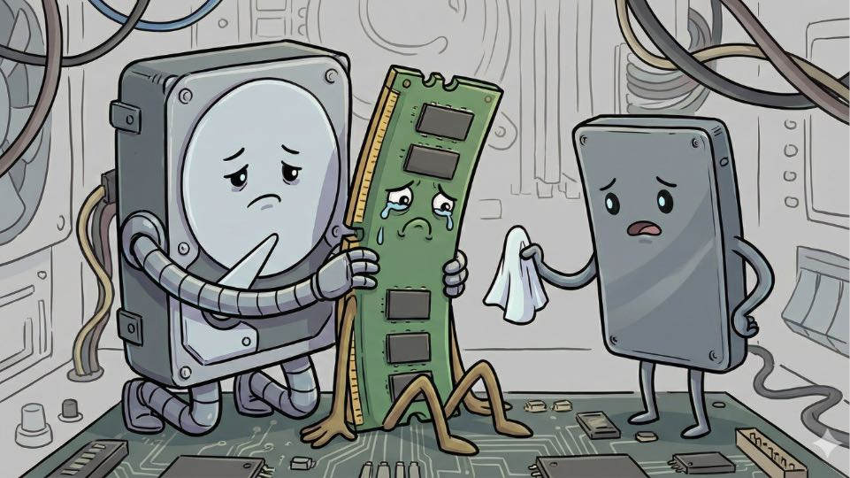
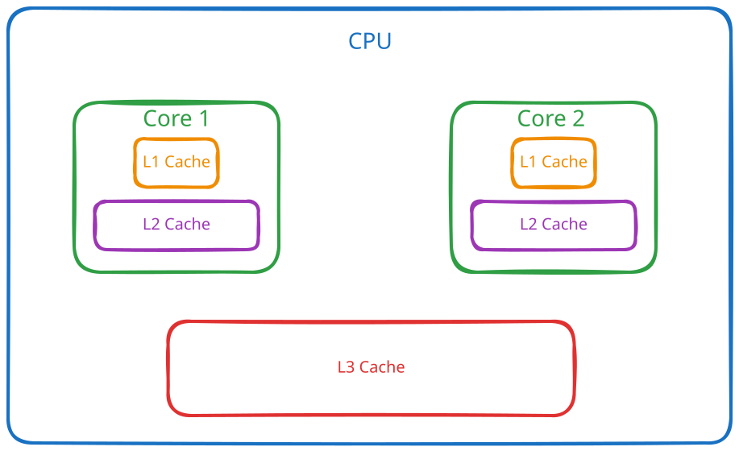

As luck would have it, apparently CPUs have similar interests to me: I care about cash locality (i.e. a lot of cash being localized in my wallet) and CPUs care about cache locality (i.e. data being localized in the CPU cache).
Bad puns aside, cache locality is a very interesting and important topic that I feel deserves more attention, so let's dive in.

## A (Hopefully) Short Refresher on CPU Caches

It's probably been a while since you were in a computer architecture class, so let's do a quick refresher on CPU Caches.
If you already know what a CPU cache is and how it works, feel free to skip to [this section](#what-is-cache-locality).

We have all been taught that RAM exists because accessing data from the hard drive is too slow. Well, at some point we decided that even RAM is too slow, so we invented CPU caches.


A CPU cache is small, very fast memory that sits very close to the CPU cores. It is usually SRAM (Static RAM) which is faster than the DRAM (Dynamic RAM) used for main memory. 
Cache is organized in levels with L1 being the smallest and fastest and every subsequent level being larger but slower.

Why not just scale up L1 and drop the other levels?
Well, this is a very complex topic, but the short answer is that it would be very expensive and it would also have diminishing returns in terms of performance. 

L1 and L2 caches are usually **private** to each core, while the L3 cache is **shared** among all cores (illustrated in the diagram below). This is not set in stone, there are some CPUs that have a shared L2 cache, but this is the general rule of thumb.



To illustrate how small these caches are, I randomly picked a current generation AMD CPU.
As per the [AMD Website](https://www.amd.com/en/products/processors/desktops/ryzen/9000-series/amd-ryzen-7-9700x.html), the Ryzen 7 9700X has:
- 640 KB of total L1 cache
- 8 MB of total L2 cache
- 32 MB of L3 cache

Given that in the Zen 5 family [the L1 and L2 caches are private](https://hc2024.hotchips.org/assets/program/conference/day2/24_HC2024.AMD.Cohen.Subramony.final.pdf), those numbers transform to 80 KB, respectively 1 MB per core. 

When the CPU needs to access data, it first checks if it is in the cache (a **cache hit**). The L1 cache is checked first, then the L2 cache and then the L3 cache. 
If the data is not found in any of the caches (a **cache miss**), it has to be fetched from RAM, which is much slower. 

To give you an idea of just how much slower, here are some rough access times:
- **L1 cache**: ~1 ns
- **L2 cache**: ~4-7 ns
- **L3 cache**: ~10-20 ns
- **RAM**: ~50-100 ns

That means a cache miss that goes all the way to RAM can be **50-100x slower** than an L1 cache hit. Keep this in mind, it will be very important when we talk about cache locality.

## What Is Cache Locality?
If you want to be technical, cache locality refers to how well a program uses **locality of reference** to leverage the CPU cache effectively.
Locality of reference has two main flavours:
- **Temporal locality**: if a program accesses a piece of data, it is likely to access it again in the near future
- **Spatial locality**: if a program accesses a piece of data, it is likely to access nearby data in the near future

So cache locality is all about **already having data you need in the cache** when you need it.

## Let's Get To Some Examples

You may think this is a very theoretical concept about which you need not care. I have some very common examples that may change your mind:

### Linked list and array list

The schoolbook distinction between a linked list and an array goes like this: linked lists are good for insertions and deletions, while arrays are good for random access.
This is true, but it is far from the whole story. In practice, arrays have MUCH better cache locality than linked lists. 
Due to them being contiguous in memory, it means that when you access an element of an array, you are likely to already have the next elements in the same cache line.
But that's not all, modern CPUs are pretty smart and, when they see you are accessing elements sequentially, they will prefetch the next cache lines in anticipation of you needing them.
So iterating over an array (read ArrayList in Java) is MUCH faster than iterating over a linked list (LinkedList in Java).

Now let's see the actual difference
```java
public static void main(String[] args) {
    int size = 1_000_000;
    int numberOfRuns = 100;

    List<Integer> arrayList = new ArrayList<>(size);
    List<Integer> linkedList = new LinkedList<>();
    int[] primitiveArray = new int[size];
    for (int i = 0; i < size; i++) {
        arrayList.add(i);
        linkedList.add(i);
        primitiveArray[i] = i;
    }

    long timeArrayList = 0;
    long timeLinkedList = 0;
    long timePrimitiveArray = 0;
    long startTime = 0;
    long endTime = 0;
    for (int i = 0; i < numberOfRuns; i++) {
        // System.nanoTime is a monotonic clock and should be good enough for our purposes
        // ArrayList
        startTime = System.nanoTime();
        iterateAndSum(arrayList);
        endTime = System.nanoTime();
        timeArrayList += (endTime - startTime);

        // LinkedList
        startTime = System.nanoTime();
        iterateAndSum(linkedList);
        endTime = System.nanoTime();
        timeLinkedList += (endTime - startTime);

        // Primitive array
        startTime = System.nanoTime();
        sumPrimitive(primitiveArray);
        endTime = System.nanoTime();
        timePrimitiveArray += (endTime - startTime);
    }
    System.out.println("Average time for ArrayList: " + (timeArrayList / numberOfRuns) / 1000 + " µs");
    System.out.println("Average time for LinkedList: " + (timeLinkedList / numberOfRuns) / 1000 + " µs");
    System.out.println("Average time for a primitive array: " + (timePrimitiveArray / numberOfRuns) / 1000 + " µs");
}

private static long iterateAndSum(List<Integer> list) {
    // summing is not really important, I just wanted to prevent the compiler from optimizing away the loop
    long sum = 0;
    for (Integer integer : list) {
        sum += integer;
    }
    return sum;
}

private static long sumPrimitive(int[] array) {
    long sum = 0;
    for (int j : array) {
        sum += j;
    }
    return sum;
}
```
What this program does is to just iterate over an ArrayList and a LinkedList of 1 million elements and sum them up, while measuring the time it takes to do so. 
Over 100 runs, the ArrayList took **1251 µs** to iterate over, while the LinkedList took **2926 µs**. Over most runs, the LinkedList was approximately **two times slower** than the ArrayList. 

The real fun starts when we compare the primitive array with the ArrayList. The primitive array took only **663 µs**. Cache locality also plays a big role here. 
With the object array, we are only keeping a contiguous array of references in memory, and we still need to fetch the actual objects (and unbox them). 

Of course, this is better than in the case of the linked list, but nowhere near as good as the primitive array, where we have a contiguous block of memory with the actual data.

### Clustered Index
If you've ever worked with databases, you know the importance that indexes play in query performance. But not all indexes are created equal.
A clustered index dictates the order in which the data is stored on the disk (therefore there can only be one per table). As you may expect by now, clustered indexes have much better data locality than non-clustered indexes.
This means that queries that can leverage a clustered index will be much faster than those that cannot, even if they are logically doing the same thing.
This does not mean that a clustered index is always the best choice, as it can have significant downsides if for example the data changes a lot, but it can pay off to know this detail when designing your database schema.

Note that I said **data** locality, not **cache** locality. While this is the same underlying principle we talked about above, clustered indexes operate at the disk level rather than the CPU cache level. This serves to illustrate that the concept of locality is not limited to CPU caches, it applies across the entire memory hierarchy, from disk to RAM to CPU cache. 
The closer your data is laid out to how you access it, the better your performance will be, no matter what level of the hierarchy you are at. Cache locality still plays a role here, but it is a less influential factor in this case.

### Modifying the Same Data in Different Threads
As I mentioned earlier, some levels of cache are **private** to each core, but what happens when two threads running on different cores are modifying the same data?
Well then cache coherency protocols kick in, which means that the CPU has to make sure that both cores see the same value for that data.
How this happens in practice is a very complex topic better left for another article, but the important thing to know is that it leads to a lot of overhead.
Let's investigate just how much overhead we are talking about.
```java 
private static final int ITERATIONS = 10_000_000;
private static final int NUMBER_OF_RUNS = 10;

// VarHandle lets us perform volatile reads and writes on individual
// elements of a plain long[], without the CAS overhead of AtomicLongArray.
private static final VarHandle ELEMENT = MethodHandles.arrayElementVarHandle(long[].class);
private static final long[] data = new long[128];

public static void main(String[] args) throws InterruptedException {
    // Warm up the JVM so that JIT compilation doesn't skew results
    benchmarkSameLocation();
    benchmarkDifferentCacheLines();

    long timeSame = 0;
    long timeDifferent = 0;

    for (int run = 0; run < NUMBER_OF_RUNS; run++) {
        timeSame += benchmarkSameLocation();
        timeDifferent += benchmarkDifferentCacheLines();
    }

    System.out.println("Same location (both threads write to data[0]):               "
            + (timeSame / NUMBER_OF_RUNS / 1_000_000) + " ms");
    System.out.println("Different cache lines (threads write to data[0] and data[32]): "
            + (timeDifferent / NUMBER_OF_RUNS / 1_000_000) + " ms");
}

private static long benchmarkSameLocation() throws InterruptedException {
    data[0] = 0;

    Thread t1 = new Thread(() -> {
        for (int i = 0; i < ITERATIONS; i++) {
            ELEMENT.setVolatile(data, 0, (long) ELEMENT.getVolatile(data, 0) + 1);
        }
    });

    Thread t2 = new Thread(() -> {
        for (int i = 0; i < ITERATIONS; i++) {
            ELEMENT.setVolatile(data, 0, (long) ELEMENT.getVolatile(data, 0) + 1);
        }
    });

    long start = System.nanoTime();
    t1.start();
    t2.start();
    t1.join();
    t2.join();
    return System.nanoTime() - start;
}

private static long benchmarkDifferentCacheLines() throws InterruptedException {
    data[0] = 0;
    data[32] = 0;

    Thread t1 = new Thread(() -> {
        for (int i = 0; i < ITERATIONS; i++) {
            ELEMENT.setVolatile(data, 0, (long) ELEMENT.getVolatile(data, 0) + 1);
        }
    });

    Thread t2 = new Thread(() -> {
        for (int i = 0; i < ITERATIONS; i++) {
            ELEMENT.setVolatile(data, 32, (long) ELEMENT.getVolatile(data, 32) + 1);
        }
    });

    long start = System.nanoTime();
    t1.start();
    t2.start();
    t1.join();
    t2.join();
    return System.nanoTime() - start;
}
```
The numbers speak for themselves. Averaged over 10 runs, the benchmark where both threads were writing to the same location took **260 ms**. The one with different locations took **65 ms**. 
This means that writing to the same location was just about **4 times slower**.

I believe this is no surprise to anyone, it is relatively intuitive that contention leads to overhead. But this is just the prelude to the less intuitive problem of false sharing, which I will talk about in the next section.

### False Sharing
Not all is sunshine and rainbows when it comes to caches, far from it. 
What happens when we are accessing different data that just so happens to live in the same cache line?
```java
private static final int ITERATIONS = 10_000_000;
private static final int NUMBER_OF_RUNS = 10;

// VarHandle lets us perform volatile reads and writes on individual
// elements of a plain long[], without the CAS overhead of AtomicLongArray.
private static final VarHandle ELEMENT = MethodHandles.arrayElementVarHandle(long[].class);
private static final long[] data = new long[128];

public static void main(String[] args) throws InterruptedException {
    // Warm up the JVM so that JIT compilation doesn't skew results
    benchmarkAdjacentIndices();
    benchmarkDistantIndices();

    long timeAdjacent = 0;
    long timeDistant = 0;

    for (int run = 0; run < NUMBER_OF_RUNS; run++) {
        timeAdjacent += benchmarkAdjacentIndices();
        timeDistant += benchmarkDistantIndices();
    }

    System.out.println("Adjacent indices (data[0] and data[1], same cache line): "
            + (timeAdjacent / NUMBER_OF_RUNS / 1_000_000) + " ms");
    System.out.println("Distant indices (data[0] and data[32], different cache lines): "
            + (timeDistant / NUMBER_OF_RUNS / 1_000_000) + " ms");
}

private static long benchmarkAdjacentIndices() throws InterruptedException {
    data[0] = 0;
    data[1] = 0;

    Thread t1 = new Thread(() -> {
        for (int i = 0; i < ITERATIONS; i++) {
            ELEMENT.setVolatile(data, 0, (long) ELEMENT.getVolatile(data, 0) + 1);
        }
    });

    Thread t2 = new Thread(() -> {
        for (int i = 0; i < ITERATIONS; i++) {
            ELEMENT.setVolatile(data, 1, (long) ELEMENT.getVolatile(data, 1) + 1);
        }
    });

    long start = System.nanoTime();
    t1.start();
    t2.start();
    t1.join();
    t2.join();
    return System.nanoTime() - start;
}

private static long benchmarkDistantIndices() throws InterruptedException {
    data[0] = 0;
    data[32] = 0;

    Thread t1 = new Thread(() -> {
        for (int i = 0; i < ITERATIONS; i++) {
            ELEMENT.setVolatile(data, 0, (long) ELEMENT.getVolatile(data, 0) + 1);
        }
    });

    Thread t2 = new Thread(() -> {
        for (int i = 0; i < ITERATIONS; i++) {
            ELEMENT.setVolatile(data, 32, (long) ELEMENT.getVolatile(data, 32) + 1);
        }
    });

    long start = System.nanoTime();
    t1.start();
    t2.start();
    t1.join();
    t2.join();
    return System.nanoTime() - start;
}
```
What we are doing here is modifying two **different** variables that live next to each other in memory, so they are in the same cache line.
I want to stress this point: they are **different** variables that just so happen to be located in the same cache line.
The results are almost the same as the previous benchmark, with the adjacent indices taking **248 ms** and the distant ones taking **62 ms**. 
This is so easy to overlook and can have a huge impact on performance. 
But two adjacent indices in an array is just a simple example that I created for demonstration purposes. This can happen in real life even on random data that just so happens to be located in the same cache line.

## My Thoughts

Cache locality can be a fringe topic and, at the level of abstraction that most of us work at, it may seem like something that we should not care about. And this may very well be right most of the time. 
The good news is that you do not need to obsess over it in your day-to-day work. Most of the time, just being aware of it is enough: choosing an ArrayList over a LinkedList, being mindful of how your threads share data, and understanding that data layout matters.
The bad news is that when it does bite you, it is incredibly hard to diagnose. There is no exception, no error log, just things being slower than they should be for no apparent reason.

---
