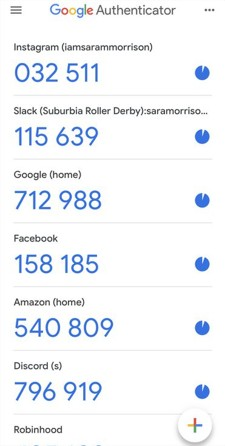
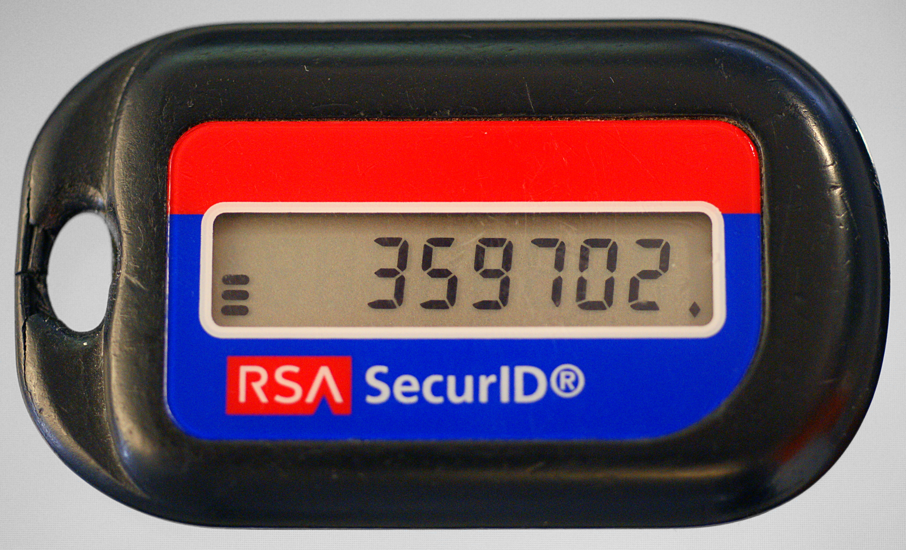

## Questions We Don't Usually Ask

**Multi-factor authentication (MFA)** has become a standard practice for securing accounts. In its most common form, you enter your password and then you are prompted to enter a one-time password from an authenticator app installed on your phone. That code keeps rotating **every 30 seconds**. 

*Screenshot of Google Authenticator (Fair Use / Wikimedia Commons)*

This is one of life's "givens" that people rarely stop to think about. But sometimes things are more interesting than they seem. 

There is the obvious potential explanation for how that code ends up on your phone. Every 30 seconds or so, your phone sends a request to the identity provider (like Google, Microsoft, etc.) and asks for a new code. The IdP then generates a random number and sends it to you. This is the mental model that I had for a long time. 

But then I remembered something. A long time ago, in the early 2000s, I distinctly remember banks issuing these small hardware tokens that would provide you with a one-time password. 

There was no way in my mind that those tokens were connected to the internet. So how could they call any IdP server? 

*A classic RSA SecurID hardware token from the 2000s (Fair Use / Wikimedia Commons)*

So I tried it on my own phone. I turned off Wi-Fi and mobile data. And the experiment sealed the deal: the codes would keep rotating as if nothing happened. So I started digging. 

## TOTP

Well, to begin with, these codes are called **TOTPs**, which stands for **Time-based One-Time Passwords**. Their name kinda gives away the secret: **time** is the key ingredient here. 

You don't have to dig very far to find out how TOTPs work. The algorithm is standardized in **RFC 6238** (referred to as "the specification" below). 

It turns out that what happens is this: 

1. When you enable **2FA** on your account, a **QR code** is provided to you. This QR code contains a **secret key** generated by the server. 
2. When you scan the QR code with your authenticator app, the app securely **stores the secret key**. 
3. Every 30 seconds, the app **generates a new code** based on the current time and the secret key. 
4. When you are asked for a code, the identity provider uses the **same algorithm** to generate a code and compares it to the one you entered.

## The Algorithm

We have already established that you can generate codes based on the current time and a secret key. 

Generally, codes are valid for **30 seconds**, but this is not mandatory. The specification allows them to be valid for much longer or shorter if needed. 30 seconds was just determined to be a good balance between security and usability.

This 30-second window is called a **time step**. What we are interested in is how many of these steps have passed since a reference time. This reference time is the **Unix epoch**, `00:00:00 UTC` on `Thursday, 1 January 1970`.

The algorithm then works as follows: 

1. Determine `t` = the number of steps that have passed from the Unix epoch to the current time. 
2. Compute an **HMAC-SHA-1** hash of the secret key and the current time step `t`. The specification also permits **HMAC-SHA-256** and **HMAC-SHA-512**.
3. Perform **dynamic truncation** to the desired number of digits. The number of digits should be at least 6, but can be up to 8 (as per the parent **RFC 4226**).

If you want to see the reference code for this algorithm, you can find it in the [RFC 6238 document](https://datatracker.ietf.org/doc/html/rfc6238#appendix-A).

## Some Interesting Points

The fact that this is just a standardized algorithm has pretty interesting implications. It means that, regardless of what identity providers like to advertise, you can use **any TOTP app** to generate codes for any service. 

You can even generate them "manually" if you like to be geeky like that (provided you have saved your secret key somewhere safe, of course).

The identity providers usually account for clock skew and network delays by allowing codes from the previous and next time steps to be valid.

## Takeaways

This article is a brief starting point for understanding how authenticator apps and TOTP work under the hood. 

What I want you to take away from here is this: 

- **Offline Generation:** Authenticator apps don't need an internet connection to generate valid codes; they generate them based on a shared secret key and the current time.
- **The Standard:** The standard algorithm for this is **TOTP** (Time-based One-Time Password), which relies on a simple combination of HMAC operations and dynamic truncation.
- **Vendor Independence:** Because it's a widely supported standard, you aren't locked into a specific provider's app. You can use any standard Authenticator app to secure your accounts, or even compute the codes yourself if you have the secret key.
