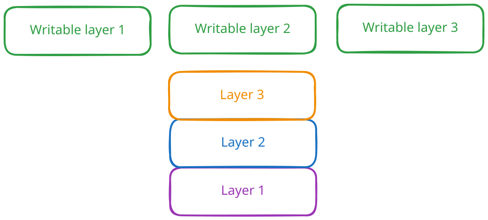
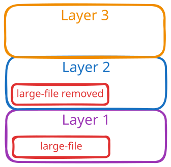
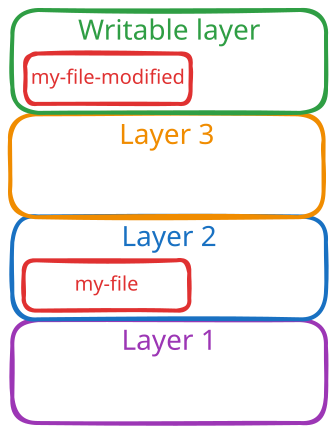

## Images and Containers

I'm sure I don't need to write a convoluted introduction about what Docker is and how containers became popular. 

First, let's quickly go over what an image and a container are and how they differ. A Docker image is the package that contains everything you need to run a container. The container is a process that runs on your machine, using the image as a template.

Building on that, I'll explain what you should know about Docker images and how to best use Docker layer caching to speed up your builds. 

## All About Layers

Docker images are smarter than they may appear at first glance. They are built in layers. Each layer is immutable and contains modifications on top of the layers below it. 
This is possible due to the Union File System (UFS), a file system that allows multiple directories to be overlaid on top of each other. 

Let's look at a simple Dockerfile and see how this works in practice. 

```dockerfile
FROM ubuntu:22.04
RUN apt-get update && apt-get install -y curl
COPY . /app
```

The "FROM" command pulls the base image, which is Ubuntu 22.04. This is the first layer. Then the "RUN" command executes a command in the container, thus creating the second layer, and the "COPY" command creates the third layer. 

### The Extra Writable Layer

When Docker creates the **container**, what it actually does is create **another writable layer on top of these layers**. This is the layer that your container will use to store any changes it makes during its runtime. 
There is a very big and interesting implication here: **if you run 100 containers based on that image, they will not take 100 times the space of the image** (so you don't need the disk space for 100 ubuntu images). Docker will reuse the lower layers and create 100 independent writable layers on top of them. 


### Removing Files From Images

There is another interesting implication of the fact that layers are readonly. When reading a file, Docker looks for it starting from the top layer and going down. Deleting a file just creates a whiteout file, which tells the file system to ignore the file in the lower layers as if it does not exist. This means that, if you delete a file in a layer, it will still take up space in the image.

```dockerfile
FROM image-containing-a-large-file:version
RUN rm /large-file
```

In this situation, running the `rm` command will not decrease the size of the image. It will just create a marker in the second layer telling the file system to consider `/large-file` deleted. The image will still look like this:



**So be especially careful if any of your layers include sensitive data.**

### Modifying Existing Files

But what happens if you want to modify an existing file? The principle of Copy-on-Write (CoW) comes into play here. When you modify a file in one of the read-only layers, Docker will first create a copy of that file in the writable layer of the container and then modify that copy. 



## The Build Cache
Building a nontrivial image can take a pretty long time. Especially since some layers would need to be downloaded from the internet, for example, the base layer. This is why Docker has a build cache. When building an image, Docker will check if it already has that layer in the cache. If it does, it will just reuse it. 
This is a very important point when building your images. **If one layer of the image changes, all subsequent layers will be invalidated and will need to be rebuilt.**
These two images would have very different build times (assuming `changed-file.txt` always changes):

Here, openjdk will be downloaded from the internet just once.
```dockerfile
FROM ubuntu:22.04

RUN apt-get update && apt-get install -y openjdk-8-jre

COPY changed-file.txt /app
```

Here, openjdk will be downloaded from the internet every time you build the image (provided `changed-file.txt` changes).
```dockerfile
FROM ubuntu:22.04

# This invalidates the cache for all subsequent layers
COPY changed-file.txt /app

RUN apt-get update && apt-get install -y openjdk-8-jre
```

## Takeaways

To make the most out of Docker layers and the build cache, keep these points in mind:
- **Order your Dockerfile intelligently:** Place commands that change frequently (like copying source code) at the very end of your Dockerfile, and slow, rarely changing commands (like installing dependencies) at the beginning. This maximizes cache reuse.
- **Layers are additive and immutable:** Deleting a file in a later step does not reduce the image size. If you need to download, extract, and clean up a large file, do it all in a single `RUN` command.
- **Beware of sensitive data:** Because layer history is preserved, a secret accidentally added in one layer and removed in the next will still be accessible to anyone who pulls the image.
- **Containers share layers:** Running multiple containers from the same image is incredibly efficient. They all share the same read-only underlying image layers, adding only the minimal storage footprint of their unique writable layer.

