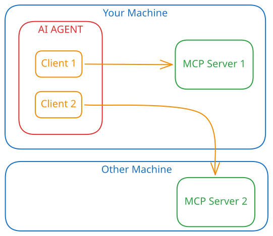

## Why MCP?

AI agents are just **LLM wrappers**. They enable the LLM (that only knows how to generate text sequences) to **interact with the outside world**. 

One of the most important ways that AI agents enable interaction with the outside world is via **tool calling**. I wrote [a dedicated article](https://alexgherghe.com/articles/how-ai-agents-use-tools.html) about tools if you are interested. Tools by themselves are great, but MCP came as a push to standardize how they are used. MCP solved a few problems: 

- **Standardization**: MCP created a standardized way for AI agents to interact with other systems. Standardization is something much needed in the AI scene, so this came as a breath of fresh air. 
- **Democratization of tools**: If, let's say, you wanted your AI agent to integrate with your company's internal tools, you would have to write a custom tool for each agent (if that was even allowed by the agent). With MCP, you can write a single MCP server that can be used by any agent that supports MCP (all of the ones that matter do support it).
- **Safety**: You could accomplish a lot of the things you can do with MCP by just asking agents to do stuff. The agent could figure out a way to do a curl to your company's API for example. But would that be safe? Would that be repeatable? 
- **Credential isolation**: If you wanted your AI agent to read data from your database, you would have had to give it your database credentials (very dangerous, would not recommend). With MCP, you can create an MCP server that can read data from your database and give it to the agent. Now the MCP server is the one that has the credentials, not the agent. As a bonus, you can severely limit what the MCP server can or cannot do. 

## The Theory

Well, to use an MCP server, you would first need to **point your agent towards it**. Different agents store that URI in different places. When in doubt, **check your agent's documentation**. If you have some tokens to spare, just give the agent the URI and ask it to **register it as an MCP server**; it should work like a charm. 

The Model Context Protocol specifies three participants: 
- The **MCP Host**: Your AI application.
- The **MCP Client**: An object that holds a connection to the MCP server.
- The **MCP Server**: The service that provides tools and context to the MCP client.

The transport layer consists of one of two possible options: 
1. **Standard Input/Output (stdio)**, for local MCP servers
2. **Streamable HTTP**, for remote MCP servers. 

For the data layer, MCP uses **JSON-RPC 2.0**.

## MCP in Action

Any interaction with an MCP server begins with the **initialization phase**: 
1. The MCP Host (via the client) sends an `initialize` request to the MCP server. It goes something like *"Hey, I am agent X version Y and I can do the following things"*. Some of the capabilities that the client can specify are:
    - **Roots** (which files/folders it can access)
    - **Sampling** (the server can ask the client to make requests to the LLM)
    - **Elicitation** (asking for user input)
    - **Tasks** (async operations)
2. The MCP server responds with its own capabilities, something like *"Hey there, I am MCP server Z version A and I can do the following types of things"*. These capabilities are:  
    - **Prompts** -> prompt templates 
    - **Resources** -> resources that can be fetched from the server 
    - **Tools** -> executable functions with defined input schemas that the agent can call to perform actions
    - **Logging** -> the server can send structured logs to the client
    - **Completions** -> the server provides auto-completion suggestions for input arguments, prompts, or resource URIs
    - **Tasks** -> the server can expose long-running background operations and stream their progress securely back to the host
3. The client sends an **"initialized"** notification to the server, signaling that it is ready to proceed. 
4. The client starts sending **discovery requests** to the server based on the server's capabilities. For example, *"Hey, what tools do you have? Hey, what resources do you have?"*
5. The server responds with the **list of tools and resources** it provides. 
6. The client can now **use the tools and resources** to perform actions. 
7. Either participant can **initiate a shutdown** according to the utilized transport protocol.

## Takeaways

The Model Context Protocol provides some **much-needed standardization** in the way that agents interact with the outside world. 

The connection between the MCP host and MCP server is **bidirectional** and works via **JSON-RPC 2.0** over either **stdio** or **HTTP**. 

The MCP client and the server go through an **initialization phase** where they exchange their **capabilities**. 
