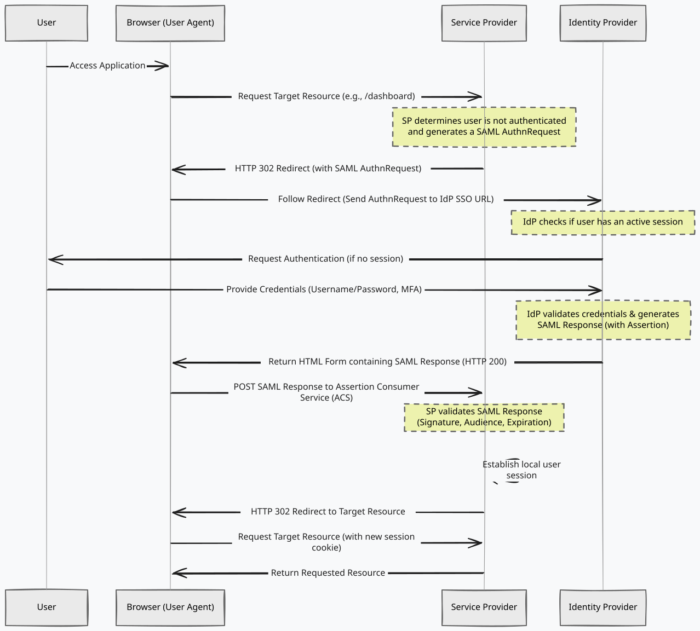
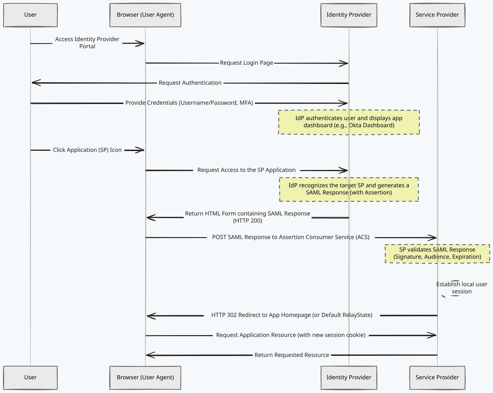

## Short Background

We use a lot of apps on a daily basis. Just imagine having to remember a unique username and password for each one of them. As bad as this sounds for you, it sounds even worse for your company's IT department. Using **SSO (Single Sign-On)** is the solution to this problem. In enterprise scenarios, SSO is most frequently implemented using **SAML**. So let's dive into how it works.

## SAML: the language

**SAML** stands for **Security Assertion Markup Language**. It is an **XML-based markup language** meant for, you guessed it, **security assertions**. In plain English, a security assertion is simply a **trusted, verifiable statement of fact** made by the **Identity Provider** to the **Service Provider** about a user's identity and their attributes. These attributes can include things like their email, username, or group memberships. 

The details of what these XML documents look like are frankly out of the scope of this article. It's one of those things that, if I really needed to know, I would end up looking it up on the spot. What's more interesting is how it all works from a higher level.

## How it Works in Brief

This dance involves 3 parties: 
- **The User** (also called **Principal**)
- **The Identity Provider (IdP)**: the place where you authenticate yourself, like Okta, Azure AD, Google SSO, etc. 
- **The Service Provider (SP)**: the service you are trying to access, like Slack, Confluence, or your company's internal tools.

### Trust Setup: The Metadata Exchange

Before the SP and IdP can start passing messages back and forth, they need to be introduced. This is where the metadata exchange comes in. 

Instead of an IT admin manually typing out URLs and uploading certificates into both systems, both the IdP and the SP can generate a **Metadata XML** file. Think of it as a digital business card. 
- The **IdP's metadata** tells the SP: "Here is my login URL, and here is the public key you need to verify my signatures."
- The **SP's metadata** tells the IdP: "Here is my Entity ID, and here is the ACS URL where you should send the user after they log in."

By swapping these files (often just by pasting a URL that hosts the XML), the two systems establish a secure **trust relationship**. It's important to note that this is generally a **one-time setup** done by an administrator (unless security certificates expire or URLs change). Once that initial handshake is done, the actual authentication dance can begin for every user without needing to exchange metadata again.

### The Authentication Flow

1. The Service Provider recognizes your organization and sees that it has **SSO configured**. This usually happens when you type your email into the login box (the SP sees `@yourcompany.com` and looks up the SSO settings for that domain) or when you navigate to a company-specific URL (like `yourcompany.slack.com`).
2. The SP then redirects your browser to the IdP with an **AuthNRequest**.
3. The IdP **authenticates you**. If you are already authenticated, this step is transparent. 
4. The IdP generates and signs a **SAML Response** containing an **assertion**. 
5. The IdP sends the SAML response to the browser, which **POSTs** it to the **Assertion Consumer Service (ACS)** endpoint of the SP. 
6. The SP **validates the signature** using the IdP's public key and logs the user in. 

## SP-initiated vs. IdP-initiated flows

SAML authentication flows differ based on who initiates them. There are two ways this can play out:

### SP-initiated flow

This is the flow I described above. You go to the **service provider** (e.g. Slack) and try to login. 

### IdP-initiated flow

In this case, you, as the user, **initiate the authentication process**. You typically access your company's **IdP** (e.g. Okta) and click on the app you want to access. The IdP then redirects you to the **SP**. 

## Takeaways

Frankly, SAML is pretty old and is not the shiniest and prettiest protocol out there. It is XML-based, which means it is verbose and generally hard to read. Newer applications tend to prefer **OpenID Connect**, which is built on top of **OAuth 2.0**. Where SAML still shines is in the **enterprise space**. 

Despite its age, SAML enables secure **Single Sign-On (SSO)**, eliminating the need for users to remember dozens of passwords while centralizing access control for IT teams.

The process involves a trust relationship between a **Service Provider (SP)** and an **Identity Provider (IdP)**, relying on securely signed XML assertions.

SAML flows can be either **SP-initiated** (starting at the application) or **IdP-initiated** (starting at the identity dashboard), but both culminate in the secure transfer of identity data.
