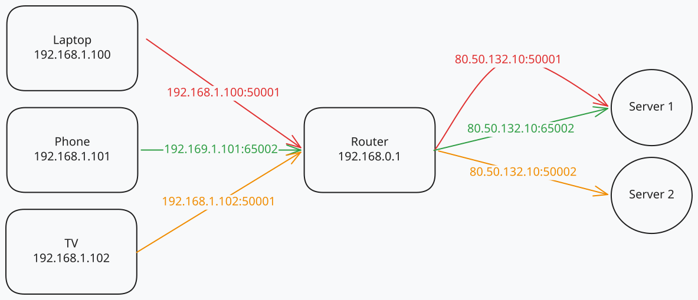

## Humble Beginnings

IPv4 addresses are comprised of **32 bits**. These 4 bytes give us **4,294,967,296** ($2^{32}$) unique addresses to work with. Is 4 billion a lot? If you are talking about money, it's a lot (but I'm sure that I can bear this great burden if anyone wants to donate a few billion to me :D). If you are talking about the scale of the internet, 4 billion suddenly becomes a very small number. 

Naturally, you may wonder why this technology that pretty much powers the entire internet was designed with such a small address space. To begin with, this protocol suite was **developed by Vinton Cerf and Bob Kahn in the 1970s**, during their time at the Advanced Research Projects Agency (ARPA) of the United States Department of Defense. But I better let Vint Cerf himself answer this question: 

> "So I said 32 bits, it is enough for an experiment, it is 4.3 billion terminations — even the defense department doesn't need 4.3 billion of anything and it couldn't afford to buy 4.3 billion edge devices to do a test anyway. So at the time I thought we were doing an experiment to prove the technology and that if it worked we'd have an opportunity to do a production version of it. Well... it just escaped! It got out and people started to use it and then it became a commercial thing." - [Vint Cerf (Google IPv6 Conference, 2008)](https://youtu.be/mZo69JQoLb8?t=815)

## How IP Addresses Are Allocated

As with most things internet related, the **Internet Assigned Numbers Authority (IANA)** is the big boss. IANA oversees the allocation of all IP addresses. It does so by delegating ranges of IP addresses to **Regional Internet Registries (RIRs)**. IANA currently splits the address range into /8 blocks and assigns them to RIRs. You can see the current allocation status [here](https://www.iana.org/assignments/ipv4-address-space/ipv4-address-space.xml#note4).

There are 5 RIRs currently in existence: 
1. **African Network Information Centre (AFRINIC)** - serves all of Africa
2. **American Registry for Internet Numbers (ARIN)** - serves the United States, Canada, and parts of the Caribbean
3. **Asia-Pacific Network Information Centre (APNIC)** - serves the Asia-Pacific region
4. **Latin America and Caribbean Network Information Centre (LACNIC)** - serves Latin America and the Caribbean
5. **Réseaux IP Européens Network Coordination Centre (RIPE NCC)** - serves Europe, the Middle East, and parts of Central Asia

What these RIRs do is further split their assigned IP address ranges and delegate them to **Local Internet Registries (LIRs)**. LIRs are usually **Internet Service Providers (ISPs)** or large organizations, like big corporations, universities or government agencies.

Here comes the catch: **RIRs have already run out of IPv4 addresses**. They have allocated everything. The last allocation happened in 2019, by RIPE. 

So, if all IPv4 addresses have been allocated, how can new LIRs get IP addresses? As you might have guessed, they can **buy them from other LIRs**. There is a **secondary market** for IP addresses and they can be quite expensive. How expensive are IPs on the secondary market? You can check out some of the prices at [ipv4.global](https://auctions.ipv4.global/?_gl=1*a05v4b*_ga*MTkyNjgxNDgyMi4xNzc4MzQ1MTM1*_up*MQ..*_ga_SPV8VXCPCY*czE3NzgzNDUxMzQkbzEkZzAkdDE3NzgzNDUxMzQkajYwJGwwJGgxNjg3NjExODI.).

## A look at Romania

RIPE publishes their [list of members](https://www.ripe.net/membership/member-support/list-of-members/). You can filter the list by country to find out all the LIRs that offer services in your country. Moreover, for every LIR, you can see the country that they are based in. If you're Romanian, you'll notice some names like the **Special Telecommunications Service** (a government agency responsible for the secure communication infrastructure of the Romanian state), **Digi** (the largest Romanian ISP and cable operator) and **Orange Romania** (the largest Romanian mobile network operator).

It turns out that RIPE publishes a lot of interesting statistics on their website. For instance, Romania has, at the time of writing this, **1087 registered Autonomous System Numbers** (an ASN is a unique number that identifies an **Autonomous System**, which is a group of IP networks that are under the control of a single entity) and **2831 unique IP prefixes**. You can see all of the statistics [here](https://stat.ripe.net/resource/RO#tab=database&database_country-resource-list.view=ipv4).

Just to give you a sense of scale, **India has 6200 registered ASNs and 9208 IP prefixes**. **The USA has 31940 registered ASNs, with 69678 IP prefixes**. 

## What Do We Do About It?

### Classless Inter-Domain Routing (CIDR)

Before NAT and private IPs were introduced, the first major life-saver for IPv4 was a change in how addresses were distributed. Originally, IP addresses were handed out in rigid, massive chunks called **"Classes"** (Class A, B, and C). For example, a Class C network gave you **254** usable addresses, while a Class B gave you **over 65,000**. If an organization needed 500 addresses, a Class C wasn't enough, so they were given a Class B, thus **wasting tens of thousands of addresses** in the process.

To fix this massive waste, **Classless Inter-Domain Routing (CIDR)** was introduced in 1993. CIDR allowed for **flexible block sizes** (like a `/23` for 512 addresses), ensuring that organizations only received the IPs they actually needed. This bought the internet valuable time before NAT became strictly necessary.

### Network Address Translation (NAT)

With only **4 billion addresses**, it's quite obvious that we can't assign a unique IP address to every device on the planet. One of the first solutions for this problem was splitting networks into smaller ones. In closed networks, like home networks or even company networks, devices can use **private IP addresses**, which are not routable on the public internet. For instance, in your home network, your phone likely has an IP address of the form `192.168.x.x`. The exact same address can be used by millions of other devices in the world with no issue. This is because that address is only valid inside your home network. 

IANA reserves **3 ranges of IP addresses for private networks** (you can find all reserved spaces [here](https://www.iana.org/assignments/iana-ipv4-special-registry/iana-ipv4-special-registry.xhtml)):
- 10.0.0.0/8
- 172.16.0.0/12
- 192.168.0.0/16

This means that these IPs **cannot be used on the public internet**. They cannot be assigned to you by your ISP. 

But your devices can use the internet, so how does that work? Well, that's where **Network Address Translation (NAT)** comes in. Network Address Translation is a process that your router performs. In essence, it entails taking a private IP address and replacing it with a public IP address when sending requests to the internet and vice versa when receiving responses. 

There are 3 main types of NAT:
1. **Static NAT** - In this case, the mapping between a private IP and a public IP is static and permanent. This would mean that, for example, your private 192.168.0.10 IP address would always be translated to, let's say, 80.50.132.10. In this scenario, NAT doesn't really save any IP addresses, but it allows devices with private IPs to access the internet.

2. **Dynamic NAT** - This type of NAT allows multiple devices to use a pool of public IP addresses. The router will assign a public IP address to a device when it needs to access the internet. 
3. **Port Address Translation (PAT)** - Also known as **NAT overload**. This is the type of NAT that your home router uses. It allows multiple devices to share a single public IP address.

### Port Address Translation (PAT) Explained

There are multiple devices on your local network (let's say a laptop, a phone, and a smart TV). Each of these devices has a unique private IP address (e.g. 192.168.1.100, 192.168.1.101, and 192.168.1.102). Your ISP gives you a single public IP address. Let's say it's 80.50.132.10. So all these private IP addresses need to be translated to the same public IP address. This works fine when sending an IP packet to the internet, but what happens when packets are returned? There needs to be some sort of discriminator that tells the router which private IP the packet is intended for. This discriminator is the **port number**. 

When a device sends a request to the internet, it uses its private IP and a random source port. As the packet passes through the router, PAT modifies it:

1. **Outbound**: The router replaces the private IP with its single public IP and assigns a unique source port. It records this mapping in its **NAT table**.
2. **Inbound**: When the server responds to that specific port, the router checks its NAT table, translates the destination back to the original private IP, and forwards the packet to the correct internal device.

Here is an example of what the router's NAT table might look like based on the diagram above:

| Internal Device | Internal IP & Port | Translated IP & Port | Destination |
| :--- | :--- | :--- | :--- |
| **Laptop** | `192.168.1.100:50001` | `80.50.132.10:50001` | Server 1 |
| **Phone** | `192.168.1.101:65002` | `80.50.132.10:65002` | Server 1 |
| **TV** | `192.168.1.102:50001` | `80.50.132.10:50002` | Server 2 |

Generally, **NAT prefers to keep the same source port**. If there is a conflict, it assigns another port from the available pool.

Because there are 65,535 possible ports, a single public IPv4 address can theoretically support tens of thousands of simultaneous connections from devices on your local network.

### Carrier-grade NAT (CGNAT)
Sometimes, ISPs end up in a situation where they have more customers than IPv4 addresses. In that case, they might elect to use **CGNAT**. The principle behind it is the same as PAT, but on a larger scale. Multiple customers share the same public IP address, and the ISP uses PAT to translate the private IP addresses of the customers to the public IP address of the ISP.

CGNAT introduces what's known as the **CGN block** (or the **Shared Address Space**), which is a range of addresses specifically reserved for this purpose. This block is formally defined by [RFC 6598](https://datatracker.ietf.org/doc/html/rfc6598) as **100.64.0.0/10** (ranging from 100.64.0.0 to 100.127.255.255), though ISPs may use slightly different internal schemes. So, if you see that your IP falls in this range, you are most likely behind a CGNAT. CGNATs have some major drawbacks for customers, such as the fact that they cannot host servers accessible from the internet, nor can they use some peer-to-peer applications.

CGNAT usage is more prevalent in developing countries or emerging economies. Basically, to have a large pool of public IPv4 addresses to play with, your country (and/or region) needed to have a relatively high demand for internet back in the early days.

### IPv6
The proper solution for this problem is the adoption of **IPv6**. 
IPv6 uses **128-bit addresses**, which gives us a total of **$2^{128}$ unique addresses**. To give you a sense of scale, that's roughly 340 undecillion addresses. That's a 340 followed by 36 zeroes. With the population of the Earth sitting at around 8 billion people, **we could give every human being on the planet around $4 * 10^{28}$ IPv6 addresses**. 

You can imagine that, with an address space so large, most of it is just not being used. In fact, IANA currently only allocates unicast IPv6 addresses from the **2000::/3** range. You can take a look at [how the IPv6 space currently looks like](https://www.iana.org/assignments/ipv6-address-space/ipv6-address-space.xhtml). If you want to see how they are allocated, you can check out the [IANA IPv6 unicast address assignments website](https://www.iana.org/assignments/ipv6-unicast-address-assignments/ipv6-unicast-address-assignments.xhtml).

Adoption of IPv6 has been slow, in part because of the massive undertaking of upgrading the global internet infrastructure. Google keeps track of [IPv6 adoption statistics](https://www.google.com/intl/en/ipv6/statistics.html).

Another major hurdle is the fact that **IPv4 and IPv6 are not directly compatible**. A device with only an IPv6 address cannot communicate with a server that only has an IPv4 address. Because of this, the internet is currently stuck in a prolonged **"Dual-Stack"** transition phase. In a Dual-Stack environment, networks and devices must run **both protocols simultaneously**. Ironically, this means that even as we transition to IPv6, we still need IPv4 addresses to talk to legacy systems.

IPv6 is a very complex topic. For instance, every network interface can have multiple IP addresses. I may write a dedicated article about this in the future.

## Takeaways

- **IPv4's limited address space was experimental:** The 32-bit design yielding ~4.3 billion addresses was never intended for a global production network, but it "escaped" the lab.
- **The primary IPv4 pool is empty:** Regional Internet Registries (RIRs) have allocated all their IPv4 addresses, pushing new requests to a costly secondary market.
- **NAT and CIDR bought us time:** Techniques like Classless Inter-Domain Routing and Network Address Translation (especially PAT) significantly delayed total exhaustion by allowing multiple devices to share single public IPs.
- **CGNAT comes with compromises:** To cope with the shortage, many ISPs use Carrier-Grade NAT, which restricts users from self-hosting servers or using certain peer-to-peer applications.
- **IPv6 is the ultimate fix, but transition is hard:** With 128-bit addresses, IPv6 offers virtually infinite capacity. However, because it's not directly backward-compatible with IPv4, the global internet remains stuck in a prolonged, dual-stack transition phase.