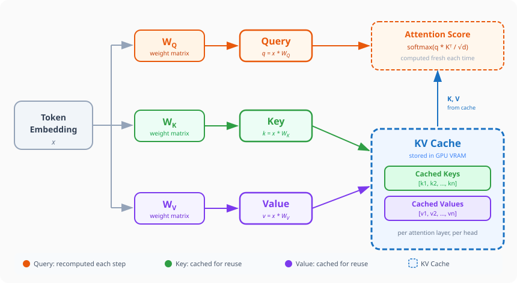
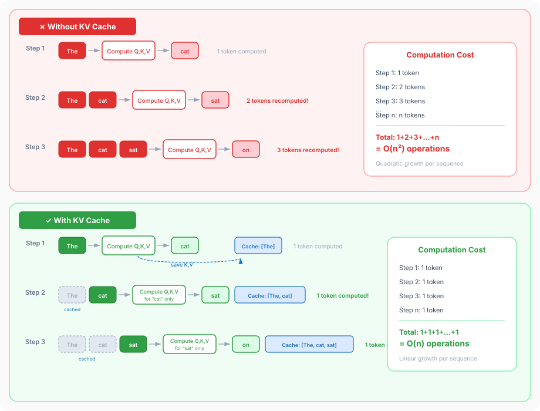

## You Might Be Burning Money

Are you switching models mid-conversation? If so, you're likely **burning through compute and wasting a lot of money**. In fact, many modern AI agents explicitly warn you against doing this.

Why? Because every time you switch models, you completely invalidate the **KV cache**. A KV cache is intrinsically tied to a specific model's architecture, weights, and dimensionality. A cache generated by Llama 3 cannot be mathematically understood by Claude 3. If your first reaction to that sentence was "What on earth is a KV cache?", then you're in the right place.

## Attention Really Is All You Need

Large Language Models work by utilizing something called an attention mechanism. In short, the whole flow looks like this: 
- You give the model some text 
- A tokenizer is used to transform that text into a **token**; the resulting value is a **token ID**
- The **token ID** is mapped to an **embedding** learned during the training process. This **embedding** is a **tensor** (a multidimensional vector), typically 1xN. 
This embedding encodes some meaning, but the meaning is pretty abstract. For our purposes, let's say that we have an embedding that means star. 
- Here's where attention comes in: every token is enriched with meaning from the tokens before it. Tokens start to encode very complex meanings. 
In our case, this is the way to differentiate between a Hollywood star and the Alpha Centauri star. 

To make this work, the model uses **Query**, **Key**, and **Value** matrices. Think of it like a library: the **Query** is what a token is looking for (like asking the librarian for a book on space). The **Key** is the label on every other token (like the title on the spine of a book). The **Value** is the actual meaning that token holds. When a Query strongly matches a Key, the model extracts that token's Value to enrich its context.

## Problems on the horizon 

### Inference is Costly
You know by now that inference is not cheap, especially if you read my previous article about [Mixture of Experts models](https://alexgherghe.com/articles/mixture-of-experts.html). Still, I want to reiterate. 
Current state-of-the-art models are **HUGE** and inference is **HUGELY EXPENSIVE**. It needs very expensive hardware, it consumes a lot of energy and it isn't that quick.
To give you a sense of scale, your laptop could probably generate something like 5 tokens per second. 

### Context Windows Are Getting Larger 
It is very common for models to have context sizes of hundreds of thousands of tokens. Models like Claude Opus deal with a million tokens. 
This brings us to a fancy technical term: these LLMs are **autoregressive**. This simply means they generate text one token at a time, predicting the next token based on all previously generated tokens. 
Because most model APIs are stateless, the **whole chat history must be sent every time to the model** so it knows what came before. 

Now imagine that you are at the end of your **1M large context window** and need to **recompute attention** for one of the million tokens. 
If you're not bankrupting the AI company, you're probably bankrupting yourself. 

## KV Cache To The Rescue
Whenever a new token is added to the input of a transformer, its query, key, and value vectors are computed. These vectors represent the token in relation to other tokens. 
They are used to compute the similarity score of 2 tokens. This is computed as a dot product between the query vector of the first and the key vector of the second, 
divided by the square root of their dimension. This similarity is then used to compute the relevance score for all token pairs, thus determining how much a token will influence another. 

What the KV cache does is to **retain the values for the key and value vectors for each token**, so we **don't need to recompute them** for each new generation. We only need to 
compute them for new tokens. 

Going back to our library analogy, the KV cache holds a massive, pre-assembled catalog of all the book spines (Keys) and contents (Values) from previous tokens. Physically, this cache consists of large tensors stored directly in the GPU's memory (VRAM). As your context window grows to hundreds of thousands of tokens, this cache can balloon to dozens of gigabytes. This insatiable hunger for expensive VRAM is exactly how the KV cache can end up draining your wallet.

The difference is dramatic. Without a KV cache, calculating attention for the entire sequence from scratch requires recomputing the interactions between every single token (that's **O(n²)** total work). With the cache, generating a single new token only requires computing the dot product of the new Query with the $n$ existing Keys, bringing the attention computation for that step down to **O(n)**.

## Shrinking The KV Cache 

The KV cache size is **measured in Gigabytes**. If you're wondering what the KV cache size may be for some models you can run locally, you can use [this calculator](https://lmcache.ai/kv_cache_calculator.html). But think of it like this: the KV cache is this big for **each conversation** you have. 
You can have multiple LLM sessions at the same time and you are not the only user, so you can imagine the scale we're talking about here.
 
With something taking up so much memory, there are a few techniques that LLM providers apply to shrink the KV cache. They can employ one of (or several of) the following: 
- **Architectural Changes**: During training, model creators often use **Multi-Query Attention (MQA)** or **Grouped-Query Attention (GQA)**. Instead of creating a unique Key and Value head for every Query head, these architectures share Keys and Values across multiple Queries, drastically reducing the baseline KV cache size.
- **Cache Eviction**: We have the attention patterns, so we know which tokens are important and which ones are not. As such, we can just evict the less important tokens out of the cache and ignore them. 
- **Cache Compression**: There are multiple algorithms for smartly quantizing the KV cache entries. Transformers usually store activations in 16 bit floating point values. Quantizing means reducing the number bits, thus sacrificing a bit of precision. There are multiple algorithms that try to preserve as much precision as possible.
- **Offloading to Other Types of Memory**: When the KV cache becomes too big to hold into GPU memory, we can offload part of it into other types of memory, such as CPU RAM or memory from specialized pieces of hardware. 

If you're interested in the wondrous world of KV cache optimization, you can read [this article](https://arxiv.org/abs/2603.20397) for a clearer picture. 

## Takeaways

- **Context is Costly**: Recomputing the attention mechanism for every token in a massive context window is an O(n²) operation that will quickly bankrupt you or the AI provider.
- **The KV Cache**: By storing the **Key** and **Value** vectors of previous tokens directly in VRAM, LLMs avoid redundant calculations, bringing the operational complexity down to O(n). 
- **Memory Hungry**: While the KV cache saves on compute, it takes up a massive amount of memory. For large context windows, the cache can balloon to dozens of gigabytes per session. 
- **Don't Invalidate the Cache**: Switching models mid-conversation forces the cache to be wiped and recomputed from scratch. Stick to one model if you want to keep costs down and generation speeds up.
- **Shrinking the Beast**: Providers use techniques like cache eviction (dropping less important tokens), quantization (compressing the data), and memory offloading to keep the KV cache manageable.