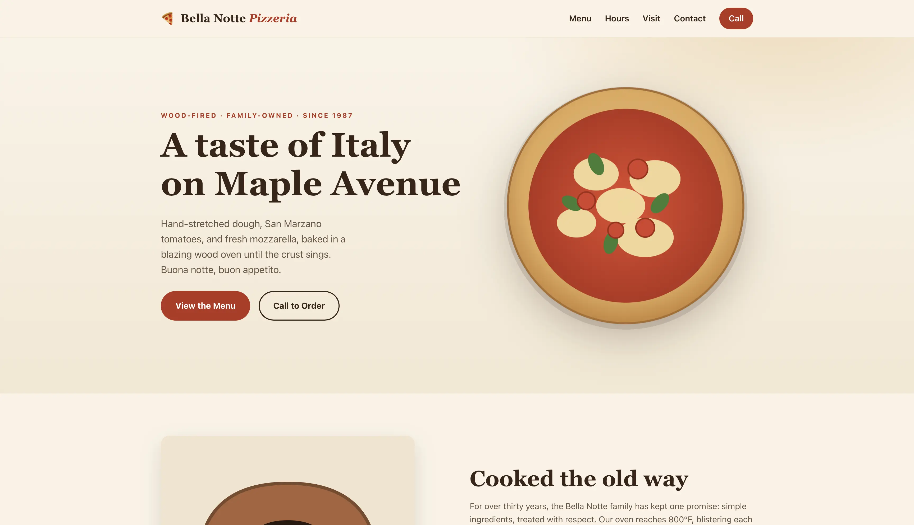
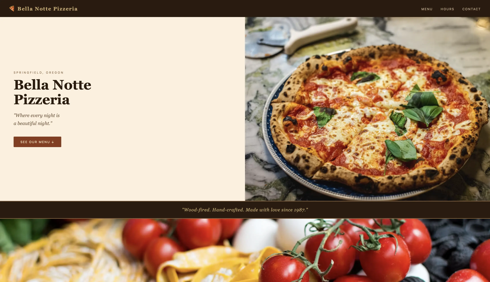
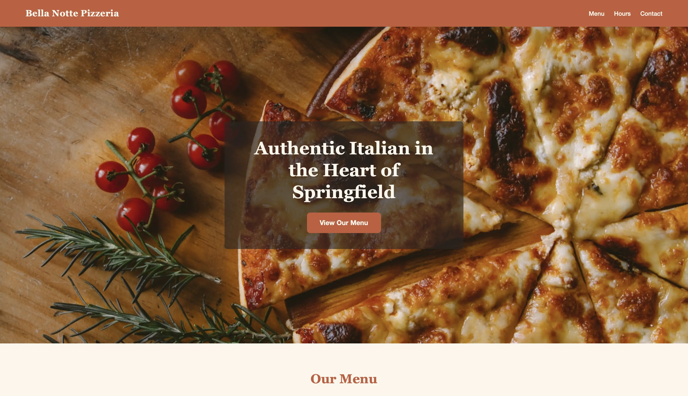

## The Pressure Is Mounting 

Recently, GitHub Copilot switched to a new pricing model that charges users based on the **number of tokens consumed**. 
This pricing model is nothing new, but what's important here is that Copilot was one of the last major holdouts that used the more lenient 
request-based pricing model. Now that they have switched to **token-based pricing**, we're all feeling the pressure of **mounting costs**. 

Even if you don't use Copilot, you might have noticed how Claude Opus 4.8 uses significantly more tokens than Opus 4.7, which in itself used more tokens than Opus 4.6.
It won't be long until the costs of using these models become truly prohibitive to the average user. 

So what's there to do?

## Going Local 

If models running in the cloud are becoming too expensive, maybe we can run them on our own machines? 
For the longest time, I thought that local models were next to useless. Recently, I decided to give them another chance and I was pleasantly surprised.

I'm not going to sugarcoat this, **you need a pretty powerful machine** to be able to run something decent locally.
I would recommend having **at least 16GB of VRAM** (or at least 16GB of free unified memory if you have a MacBook). Of course, you need a dedicated or something with a powerful enough integrated GPU, like a MacBook Pro. 
A MacBook Pro is what I used to run the models here, so this is what I can speak to with certainty.

### The Tooling 

To run models locally, you need a few things:
- **A model manager**. Something like Ollama or LM Studio. These tools make it easy to download local models and run them on your machine. I used LM Studio because it comes with MLX optimized models (the Apple machine learning framework for Apple Silicon).
- **A local model**. I used Qwen 3.6 35B and Gemma 4 26B (both at 4-bit quantization). Qwen takes up **19GB of VRAM** just to load the weights, while Gemma takes **14.5GB**. Sprinkle another few GB on top for the KV cache and you end up needing **a lot of memory** to run these models. 
To also try something lighter, I gave Qwen 3.5 9B a shot. It only takes 6.4GB to load.
- **A local harness** to use with the models. I used Claude Code because that's what I'm used to, but you can use whatever you want. Is Claude Code the best option? Probably not, but nobody wants to spend time relearning how to code agentically.

### The Benchmark 

I needed a way to test the models, so I decided to use two very simple benchmarks: 
- **Implementing a mathematical expression interpreter and calculator**. This would test the model's ability to use logic and write code.
- **Creating a website for a pizza place**. This would test the model's design and creativity skills. 

To give all the models a fair shot, I used Claude to generate a spec file for both benchmarks and I used Superpowers (a Claude plugin) to implement the spec. 
I also used both Claude Opus and Sonnet as control models to compare my local models to. 

### The Calculator 

This is the spec i used for the calculator: 
```markdown
# Expression Calculator — Build Specification

Build a command-line **expression calculator** from scratch in **Java**.

## How it runs (required contract)

Your solution MUST be runnable via a script named `run.sh` in the project root:

- `./run.sh` reads **one expression per line from standard input**.
- For each non-blank input line, it prints **exactly one result line to standard output**.
- Blank input lines produce **no output**.
- Variable/function state persists across lines within a single run (it is a REPL).

The grader only ever calls `./run.sh`. You may organize the Java code however you like
(single file, multiple files, a build tool) as long as `./run.sh` works from a clean
checkout on a machine with a JDK installed.

Example session (stdin on the left, stdout on the right):

1 + 2 * 3        ->  7
x = 4            ->  4
x * 2            ->  8
sqrt(9)          ->  3
1 / 0            ->  Error: division by zero

## Language features

### Operators and grouping
- Binary operators `+`, `-`, `*`, `/` with standard precedence (`*` and `/` bind tighter
  than `+` and `-`).
- Operators of equal precedence are **left-associative**: `10 - 4 - 3` is `3`, not `9`.
- Parentheses `( ... )` for grouping.
- Unary minus: `-5`, `-3 * -4` is `12`, `2 - -3` is `5`.

### Numbers
- Integer and decimal literals (e.g. `42`, `3.14`, `0.5`).
- Evaluate using floating point (IEEE double).

### Variables
- Assignment: `x = <expression>`. The assignment evaluates the right-hand side, stores it
  under the name, and **prints the stored value**.
- A name consists of letters, digits, and underscores, and does not start with a digit.
- Referencing a variable before it has been assigned is an error.

### Functions and constants
- Functions: `sqrt(x)`, `abs(x)`, `pow(a, b)`, `min(a, b)`, `max(a, b)`.
- Function arguments may themselves be expressions: `pow(2, 1 + 2)` is `8`.
- Constant: `pi` (3.141592653589793).

## Output formatting (must be exact)

- Results that are mathematically integers print with **no decimal point**: `6 / 2` prints
  `3` (not `3.0`).
- Non-integer results print with **up to 6 decimal places, trailing zeros removed**:
  `1 / 3` prints `0.333333`; `2.50` prints `2.5`.
- Rounding to 6 decimals also absorbs floating-point noise: `0.1 + 0.2` prints `0.3`.

## Errors

On any malformed input, division by zero, unknown variable, unknown function, or wrong
number of function arguments:

- Print a line that **begins with `Error:`** (a short reason after it is encouraged but not
  required), then **continue reading the next line**. The program must not crash or exit.

Example:
1 / 0        ->  Error: division by zero
2 + 2        ->  4
unknownvar   ->  Error: unknown variable 'unknownvar'

## What you do NOT need to build

No conditionals, loops, user-defined functions, string values, or multiple statements per
line. Keep it focused on the features above.
```

Alongside this spec, I (and Claude) created a test suite comprised of 48 total test cases to validate the correctness of the implementations. 
The results are as follows: 
- **Claude Opus 4.8 and Sonnet 4.6**: These were control models, and they both passed all 48 test cases without any issues.
- **Qwen 3.6**: Qwen really did impress me. First, the generation speed was quite decent. At almost 40 minutes to finish the task, it did not compare with Claude, but let's not forget that it was running on my laptop. 
At first, it did not pass any tests, but the issue was just the way that it defaulted to the working directory being the one from which I ran my grader, so it did not compile. With a very minor tweak to fix this issue, it passed all 48 tests. 
- **Gemma 4**: At first, Gemma was really rough for me. It failed a lot while calling tools and spawning subagents. A lot of the times, it would just go like "Now I am spawning the subagent to start task 1" and then nothing would happen. 
It was relatively frustrating and I gave up on it. I even tried to use a less aggressive quantization, 8 bit instead of 4 bit, but it did not help. It would get stuck in the same way. Perhaps it did not like Claude Code as a harness, but then I don't like it either.
- **Qwen 3.5**: The smaller Qwen model handled tool usage and subagents with no issues, but it struggled a lot with actually writing the code. It encountered a lot of compilation errors and it didn't really manage to fix them in the end. 

### The Pizza Place Website

For the pizza place website, this is the spec I used: 
```markdown
# Pizza Place Website — Build Specification

Build a **single-page presentation website** for the fictional pizzeria described in the
**Brief** below. Use **only static HTML, CSS, and JavaScript** — no frameworks and no build
step. You choose all layout, styling, imagery, and marketing copy; the Brief fixes the
facts the page must contain.

## The Brief (these facts must appear on the page)

- **Business name:** Bella Notte Pizzeria
- **Address:** 742 Maple Avenue, Springfield, OR 97477
- **Phone:** +1 (541) 555-0123
- **Opening hours:**
    - Mon–Thu: 11:00–22:00
    - Fri–Sat: 11:00–23:00
    - Sun: 12:00–21:00
- **Menu** (group these into the three categories shown; prices exactly as written):
    - **Pizzas:** Margherita $12.00 · Pepperoni $14.00 · Quattro Formaggi $15.50 · Diavola $15.00
    - **Sides:** Garlic Knots $6.00 · Caprese Salad $8.50
    - **Drinks:** Italian Soda $3.50 · Espresso $2.50

## Required page content

The page MUST include all of the following:

1. A **header** containing the business name (text — a logo image alone is not enough).
2. A **hero section** with a headline and at least one prominent image.
3. The **menu**, showing every item above with its name and price.
4. The menu items **grouped into the categories** Pizzas, Sides, and Drinks.
5. The **opening hours** for all seven days (the weekday/weekend breakdown above is fine).
6. The **street address**.
7. The **phone number** as a clickable `tel:` link.
8. A **contact section** — either a form (name / email / message) or at least a `mailto:` link.
9. **At least 3 images** total (`` elements).
10. A **footer** with a copyright line and at least one social-media link.
## Output formatting

- Prices must appear exactly as written above, in `$D.DD` form (e.g. `$12.00`).
- The category names must appear as the words **Pizzas**, **Sides**, **Drinks**.

## What you do NOT need to build

No backend, no real form submission, no database, no multiple pages, no framework or
bundler. A single self-contained static site is the whole task.
```

I will just show you a screenshot of the resulting website for each one and you can decide for yourself how they did.

This is Opus 4.8: 


This is Sonnet 4.6:


This is Qwen 3.6:


## The Good

**The Qwen family of models really impressed me.** I expected local models to be almost useless and I was pleasantly surprised to see that they can actually do a decent job at some tasks.
If you already have a pretty powerful machine, you can **run these models locally for really cheap**. I would not recommend you to buy hardware specifically for this purpose, as it doesn't really make sense economically.
But assuming you have a MacBook Pro, 8 hours of running the model would cost around 25 cents of electricity in Romania, so that's a really good deal.

## The Bad

Let's not kid ourselves here, these models are **considerably less capable** than the expensive cloud-hosted state-of-the-art models.
The fact that Gemma 4 did not even manage to finish the calculator task was really disappointing.
**Your laptop will get really hot and the fans will get really loud.** The model will take up most of your RAM, limiting what else you can do while it's running. The generation speed is also pretty slow, especially for the larger models.
**Running the models is pretty fiddly.** For example, I tried to use a 256k context window for both Qwen and Gemma (the max they can work with) and it failed spectacularly. This seems to be related to the max size of the KV cache. After two hours, Gemma was still working on the first step of the calculator task. 
Only after reducing it to 180k did it manage to work properly.

## Takeaways

If there's only one thing you take away from this article, let it be that **you can run some pretty decent models locally and it's definitely worth giving it a try**. 
The Qwen family of models in particular is one I like a lot. 
You can use things like Ollama and LM Studio to manage your local models. 
You can then use your favourite agentic harnesses, such as Claude Code and Codex with your local models and it's actually very easy to do.
