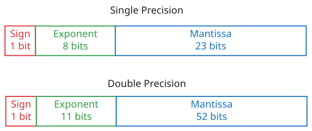
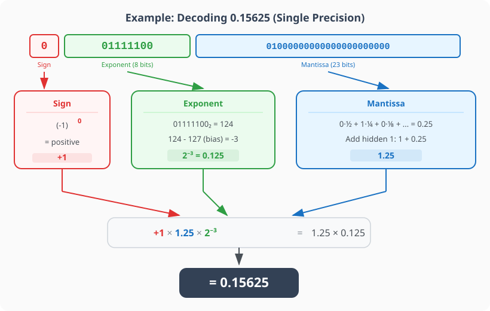

## Hard-Learnt Lessons

All software developers learn very early in their careers that **floating point arithmetic is not exact**. Even more so, they learn that `a - b < some_delta` is preferable to `a == b` when comparing floating point numbers.
But why is that? Why does `0.1 + 0.2` not equal `0.3`?

# Bits and Bytes

Computers work with 0 and 1, bits and bytes. For integers, this mapping is pretty straightforward. For example, the number 5 is represented in binary as `101`, which is `1*2^2 + 0*2^1 + 1*2^0`.
For floating point numbers, the mapping is a bit more complicated. 
The first thing that complicates this is mathematics itself. When stepping out of the integer world, we enter the world of **real numbers**. Real numbers are infinite and continuous, while integers are discrete and finite.
This means that we cannot represent all real numbers exactly in a finite number of bits. So we just do our best. 

If you were to take the most naive approach, you could represent a floating point number with 2 bytes: the first byte would be the integer part and the second byte would be the fractional part. 
But this severely limits the range and precision of the numbers you can represent. For example, with 2 bytes, you could only represent numbers between 0 and 255 with a precision of 1/256.

To solve this problem, we use a different representation called **IEEE 754**. This representation uses 4 bytes (32 bits) for single precision and 8 bytes (64 bits) for double precision.
The way it works is that it splits the binary representation of the number into 3 parts: the sign bit, the exponent, and the mantissa (or significand).


The formula for the value of a floating point number is:
```
(-1)^sign * (1 + mantissa) * 2^(exponent - bias)
```
Where the bias is a constant that depends on the precision (127 for single precision and 1023 for double precision).

## Putting It Together

That formula might look intimidating at first, so let's walk through a concrete example. Let's take the number **0.15625** and see how it's actually stored in single precision.

In memory, 0.15625 is stored as these 32 bits:
```
0 01111100 01000000000000000000000
```

Each part maps directly to a piece of the formula:

**Sign** → The sign bit is `0`. Plugging that in: $(-1)^{0} = +1$. The number is positive.

**Exponent** → The 8 exponent bits are `01111100`, which in decimal is $124$. We subtract the bias: $124 - 127 = -3$. So the exponent part gives us $2^{-3} = 0.125$.

**Mantissa** → The 23 mantissa bits are `01000000000000000000000`. Each bit represents a fraction: the first bit is $\frac{1}{2}$, the second is $\frac{1}{4}$, and so on. Only the second bit is set, giving us $\frac{1}{4} = 0.25$. The formula has a **hidden 1** baked in (the `1 + mantissa` part), so the full significand is $1 + 0.25 = 1.25$.

Now we just multiply everything:

$$+1 \times 1.25 \times 2^{-3} = 1.25 \times 0.125 = 0.15625$$



This example works out perfectly because **0.15625 can be represented exactly** in binary ($0.00101_{2}$). But most decimal fractions aren't that lucky.

## Implications 

### Special Values
IEEE 754 also defines what happens when we need to represent something that isn't a standard number. If all bits of the exponent are set to `1` and the mantissa is all `0`s, the value represents **Infinity** (positive or negative, depending on the sign bit). If the exponent is all `1`s and the mantissa has any non-zero bits, the result is **NaN** (Not a Number), which occurs during undefined operations like `0 / 0`.

### So Why Does 0.1 + 0.2 ≠ 0.3?

The number **0.1** in binary is $0.0\overline{0011}$, a repeating pattern that goes on forever, just like how $\frac{1}{3}$ becomes $0.333...$ in decimal. Since we only have 23 mantissa bits (single precision) or 52 bits (double precision), we have to **cut it off** somewhere. That tiny rounding error is why:
```
0.1 + 0.2 = 0.30000000000000004
```

The error is incredibly small, on the order of $10^{-17}$, but it's not zero. And that's the fundamental tradeoff of floating point: we gain an enormous range of representable values, but we **sacrifice exact precision** for most decimal fractions.

### Unit of Last Precision
The exponent can be a very very large number and the mantissa will always be something between one and 2. In double precision, this mantissa has 52 bits. 
You can consider that these 52 bits create $2^{52}$ intermediary points between the values of the exponent. 
Given that the exponent is, well, exponential, the distance between two consecutive values of the exponent grows exponentially as well.
This means that these $2^{52}$ intermediary points have to cover a greater and greater distance. So, as we deal with larger numbers, our precision decreases. 
This is why we have a concept called **Unit of Last Precision (ULP)**, which is the distance between two consecutive floating point numbers at a given magnitude.

To see this in practice, try evaluating `1.0e16 + 1.0 == 1.0e16` in Java. It evaluates to `True`. At a magnitude of $10^{16}$, the gap (ULP) between consecutive floating point numbers is actually larger than 1. Adding 1 simply gets rounded away because the next representable number is 2 units away.

## Takeaways

1. **Floating point numbers trade exactness for range.** By using scientific notation under the hood, they can represent both microscopic and astronomical values, but often introduce tiny rounding errors for common decimal fractions.
2. **Never use `==` for floats.** Because of these tiny errors, you should always compare floats using an epsilon: `abs(a - b) < 1e-9`.
3. **Beware of precision loss at high magnitudes.** When dealing with extremely large numbers, the distance between representable floats grows significantly. Adding small values to massive numbers will result in the small values being entirely swallowed by the precision gap.
