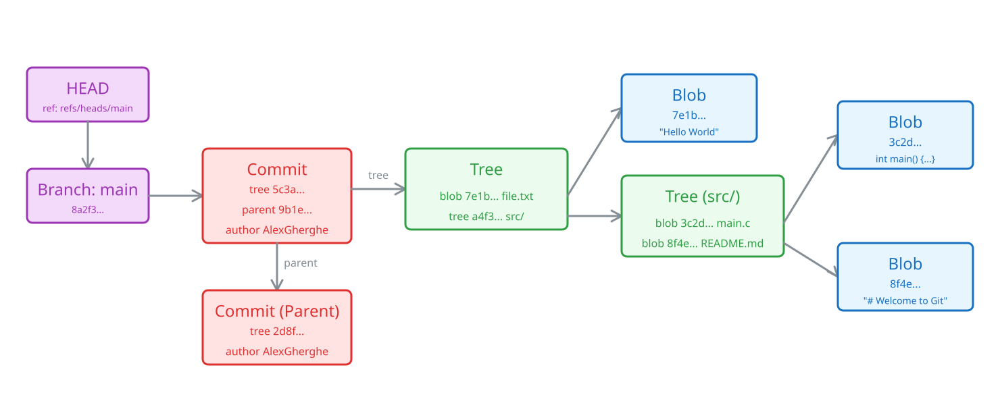

## A Fun Fact To Get Us Started

Given that Git is one of the cornerstones of modern software development, you might imagine that it started its life as a grand project with a team of developers working on it. 

The reality is much more interesting: **Linus Torvalds built Git in 2005** because his free license for BitKeeper (the version control system he had been using at that time) was revoked. So Git started life as a simple utility to help Linus work on the Linux kernel. 

## Core Concepts

Git only has **3 core concepts** behind the scenes: 

- **Blobs**: blobs are just file contents. They do not store filenames or permissions, only the raw data inside the file.
- **Trees**: you can think of trees as folders. Trees are just files that point to other blobs or trees, along with their names and file modes, just like directories point to files or subdirectories.
- **Commits**: commits are objects stored on disk that point to a tree and contain some metadata about committer, author, timestamps and potentially the parent commit. We'll come back to the parent commit later.  

Before we go further, let's make sure we have this picture in our minds. Firstly, let me draw an actual picture for any visual learners: 


## But What About Branches? 

"But what about branches?" I hear you ask. 

This may come as a surprise to you, but **structurally, branches aren't anything special to Git. Branches are just files that point to a commit.** That's it. 

This is very elegant in its simplicity, but I have to admit that I found this concept mind-blowing when I first took a deeper dive into how Git works. 


## And What About Tags?

Now that you know that branches are just files that point to a commit, you might already be guessing what tags are. If you're thinking "tags are also just files that point to a commit", then congratulations, you've cracked the code. 

**Lightweight tags** are stored in `.git/refs/tags/` instead of `.git/refs/heads/`, but the idea is exactly the same: a file containing a commit hash.

The key difference is that **branches move**. Every time you make a new commit, your branch file gets updated to point to the new commit. **Tags, on the other hand, are meant to stay put.** When you tag a release as `v1.0.0`, that tag will always point to the same commit. 

Think of branches as bookmarks you keep moving forward as you read, and tags as sticky notes you leave on a page you want to come back to.

There are also **annotated tags**, which are a bit more involved. Instead of pointing directly to a commit, an annotated tag points to a **tag object** stored in `.git/objects`, which is technically a fourth object type in Git's data model. This tag object contains metadata like the tagger's name, a date, and a message, before pointing to the actual commit. 

So annotated tags are to lightweight tags what commits are to branches: **they add a layer of metadata on top of a simple pointer.**

## The Staging Area

There is one more concept that trips people up: the staging area, also known as the index. You interact with it every time you run `git add`, but most people never really think about what it is.

The staging area is essentially a **draft of your next commit**. It's stored in the `.git/index` file (you'll see it when we look at the `.git` directory in the next section). 

When you run `git add somefile.txt`, Git takes a snapshot of that file **at that exact moment**, stores it as a blob in `.git/objects`, and then updates the index to say "the next commit should include this version of somefile.txt".

**An important subtlety here:** since the snapshot is taken when you `git add`, if you modify the file again after staging it, **the staged version will be outdated**. Git will not automatically update it. You would have to run `git add` again to stage the new version. 

As the [official git-add documentation](https://git-scm.com/docs/git-add) puts it: "It only adds the content of the specified file(s) at the time the add command is run; if you want subsequent changes included in the next commit, then you must run git add again to add the new content to the index." 

This is exactly why `git status` distinguishes between "Changes to be committed" (what's in the staging area) and "Changes not staged for commit" (what's different in your working directory compared to the staging area). When you finally run `git commit`, Git packages up whatever is currently in the staging area, not whatever is in your working directory.

Now, you might be thinking "I've never had to re-add a file before committing". That's likely because most IDEs automatically stage your modified files when you commit through their UI. For example, VS Code has a feature called [Smart Commit](https://code.visualstudio.com/docs/sourcecontrol/overview) (`git.enableSmartCommit`) that automatically stages all changes when you click the commit button with nothing explicitly staged. IntelliJ IDEA goes even further: its default [Changelists](https://www.jetbrains.com/help/idea/commit-and-push-changes.html) workflow bypasses the staging area entirely, automatically running `git add` and `git commit` together for whichever files you've checked in the commit window. So the staging area is still there, your IDE is just hiding it from you.

This is why you can `git add` only some of your changes and leave others out of the commit. The staging area gives you fine-grained control over what goes into each commit. **It's the buffer between your working directory (the files you see and edit) and the repository (the committed history).**

A nice way to think about it: your working directory is your messy desk, the staging area is the neat pile of papers you've selected and organized, and committing is putting that pile into the filing cabinet.

## You Can See Everything On Your Machine
If you have a Git repository cloned on your machine, you can look at how Git stores data. You might actually have an epiphany. 
Inside the directory with your repository, there is a hidden folder called `.git`. A quick `ls -lah` will reveal it. You don't have to actually follow along on your machine, I'll paste the results of the `ls` here: 
The contents of the `.git` directory look like this: 
```plaintext
total 88
drwxr-xr-x@  15 alexandrugherghe  staff   480B Jun 19 23:21 .
drwxr-xr-x   21 alexandrugherghe  staff   672B Jun 19 23:22 ..
-rw-r--r--@   1 alexandrugherghe  staff    10K Jun 19 23:29 .DS_Store
-rw-r--r--@   1 alexandrugherghe  staff    23B Jun 15 22:55 COMMIT_EDITMSG
-rw-r--r--@   1 alexandrugherghe  staff    99B May 10 15:40 FETCH_HEAD
-rw-r--r--@   1 alexandrugherghe  staff    21B Mar  9 00:23 HEAD
-rw-r--r--    1 alexandrugherghe  staff    41B Jun 15 22:54 ORIG_HEAD
-rw-r--r--@   1 alexandrugherghe  staff   313B Feb 15 17:00 config
-rw-r--r--@   1 alexandrugherghe  staff    73B Feb 15 16:57 description
drwxr-xr-x@  16 alexandrugherghe  staff   512B Feb 15 16:57 hooks
-rw-r--r--@   1 alexandrugherghe  staff   5.5K Jun 15 22:55 index
drwxr-xr-x@   3 alexandrugherghe  staff    96B Feb 15 16:57 info
drwxr-xr-x@   4 alexandrugherghe  staff   128B Feb 15 16:59 logs
drwxr-xr-x@ 219 alexandrugherghe  staff   6.8K Jun 19 23:21 objects
drwxr-xr-x@   6 alexandrugherghe  staff   192B Jun 19 23:21 refs
```
For the moment, we only care about a few things from here. Let's start with the HEAD file. HEAD is just a file that contains a reference to the branch we're currently on. 
More precisely, it is a symbolic reference to the file of the branch we're currently on. If I run `cat ./.git/HEAD`, I will get
```plaintext 
ref: refs/heads/main
```
Now I will direct your attention to the `refs` directory. It contains the files associated with our branches (those files that just point to commits). 

**Now comes another very interesting point.** Most developers work with branches called `feature/something` or `release/something` by sheer reflex. What's interesting is that Git actually creates the `feature` or `release` directories on disk in these cases. So the slashes are not just for design, branches do really get organized into directories on disk! This is also why you cannot have a branch named `feature` and another branch named `feature/login` simultaneously: your operating system cannot have both a file and a directory with the exact same name in the `refs/heads/` directory.

`cat ./.git/refs/heads/main` gives me `186a04be0c4ff3cea061e84dff15e8be4b12ef2a`, which is the latest commit on my main branch. Now, if we want to be pedantic, we can use our newly acquired knowledge to say "it is the commit that the main branch is pointing to" instead of "the latest commit on my main branch". If you want your colleagues to think you've hit your head on your way to work, please go ahead and use this wording in the office. 

That sequence of characters `186a04be0c4ff3cea061e84dff15e8be4b12ef2a` is just a SHA-1 hash of the contents of the commit object (though Git has been transitioning to SHA-256 since version 2.29). 

The `objects` directory is where Git stores all its blobs, trees and commits. Objects are organized into subdirectories named after the first two characters of their hash, so our commit `186a04be...` lives at `.git/objects/18/6a04be...`. You can use `git cat-file -t HEAD` to confirm the type of an object (in this case, `commit`), and `git cat-file -p HEAD` to see its contents. In my case, the output looks like this: 
```plaintext
tree 77801ca10e6911c31748be7f9c37c222b77b5590
parent 9a6b7f5597033bcfebbe055e377cc0faaf037295
author AlexGherghe <[EMAIL_ADDRESS]> 1781553314 +0300
committer AlexGherghe <[EMAIL_ADDRESS]> 1781553314 +0300

floating point article
```
So this is what a commit file looks like. It just gives you a pointer to the tree of the files in that commit. You can use this to fetch all of the contents of all of the files you need to reconstruct the whole project at the point of that commit. The parent pointer just points to the commit that came before this one. You can use this to reconstruct the whole history of the project. 

## Deleting a Branch is a Dangerous Illusion 

Let's say you have made a mistake and committed some credentials on a feature branch. You can just delete the branch or `reset --hard` and fix the problem. Right? Right????
Well... hate to break it to you, but that's not really the case. Let's take the two commands apart and see what they really do: 

- `git reset --hard` just changes the commit that your branch points to, **it doesn't touch the objects**
- deleting a branch just deletes the pointer file in `.git/refs`, **it also doesn't touch the objects**

This means that your "deleted" secret credentials are **still sitting in your `.git/objects` folder** (either as loose objects or packed inside a packfile). Anyone with access to the repository could theoretically find that "orphaned" commit by inspecting the objects directly or running `git fsck --unreachable` to list unreachable objects. Furthermore, if you had already pushed that branch to a remote repository like GitHub, the commit containing your secrets is now stored on their servers too.

To actually scrub data from Git, you have to use history-rewriting tools (like `git filter-repo` or BFG Repo-Cleaner) to hunt down and force Git to delete the underlying objects locally and remotely. 

Of course, orphaned commits don't just sit there wasting space indefinitely. Git will eventually clean them up during a process called garbage collection (`git gc`), which runs automatically after certain operations like `git push` or `git merge`. You can also trigger it manually. However, by default, unreachable objects are kept for at least 2 weeks before being pruned, so there's a significant window of exposure. 

## Key Takeaways

- **Everything is a file.** Blobs, trees, commits, branches, tags: Git stores all of them as simple files on disk. Once this clicks, Git goes from "black magic" to "oh, that's just a file."
- **Branches and tags are just pointers.** A branch is a file containing a commit hash that moves forward with each new commit. A tag is the same thing, but it stays put. There's nothing more to it.
- **The staging area is your draft.** `git add` snapshots a file *at that moment* and stages it for the next commit. Your IDE might hide the staging area from you, but understanding it gives you fine-grained control over your commits.
- **Deleting doesn't mean gone.** Deleting a branch or resetting only removes the pointer, not the underlying objects. Sensitive data requires history-rewriting tools to truly remove.
- **Explore your `.git` directory.** The best way to solidify these concepts is to poke around your own `.git` folder. Use `git cat-file -p` to inspect objects and see the data structures for yourself.

### Further Reading

- [Official Git Documentation](https://git-scm.com/doc): the definitive reference for all Git commands and concepts.
