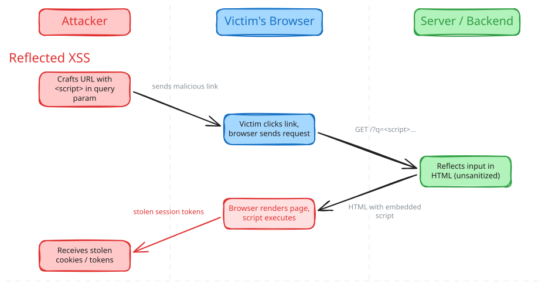
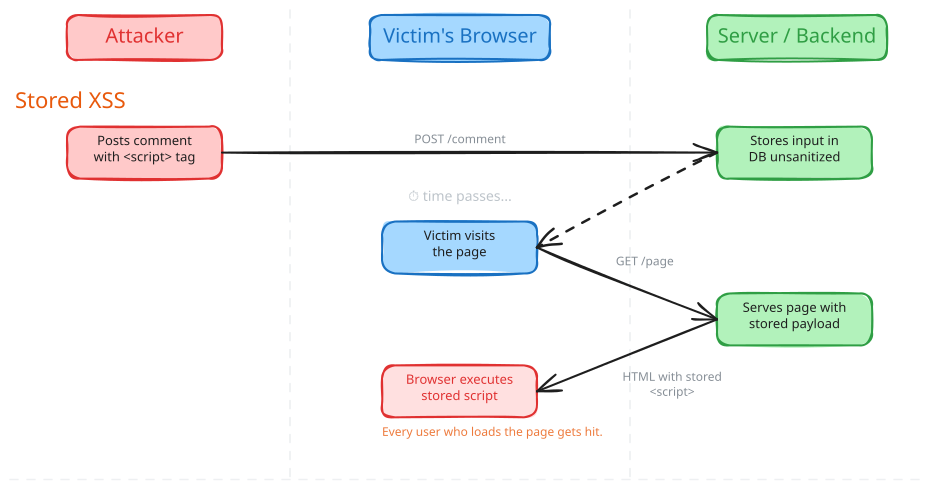
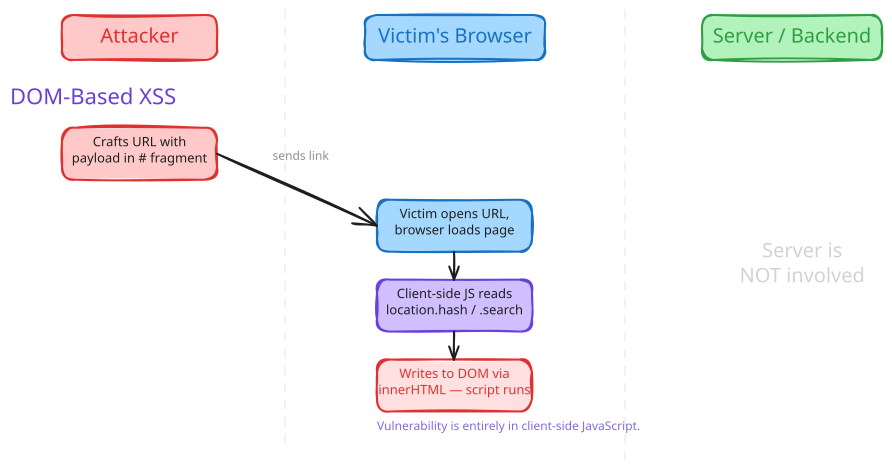

## What XSS Is 

Are you taking in text input from your frontend? Then congratulations! You may be vulnerable to Cross-Site Scripting. 

In short, XSS is a vulnerability that allows attackers to inject malicious scripts into web pages. If you're rendering user input directly to the DOM without properly sanitizing it, you're handing attackers the keys. Once they get a script running in a user's browser, the possibilities are grim: **session hijacking** (stealing cookies to impersonate users), **keylogging**, **phishing overlays** injected into your own page, or even full **account takeover**. 

## The Flavours of XSS
XSS comes in three flavours: 

### Reflected XSS

You need a backend and a frontend for this to work. The attacker crafts a URL with a malicious script tucked into a query parameter (something like `?q=<script>steal(document.cookie)</script>`). They trick a victim into clicking it (phishing email, dodgy forum post, you name it).

The victim's browser sends the request to the server, the server reflects that input straight into the HTML response without sanitizing it, the browser renders the page, and boom, the script executes.

The key thing about reflected XSS is that it's **one-shot**: the payload lives in the URL, not on the server. Every victim needs to click the crafted link.


### Stored XSS

This one is nastier. Instead of hiding the payload in a link, the attacker submits it somewhere the server will **persist** it (a comment field, a profile bio, a forum post). The server stores the malicious script in its database without sanitizing it.

Now every single user who loads that page gets the payload served to them automatically. No crafted link needed. One injection, many victims. This is why stored XSS is generally considered more dangerous than reflected, as the blast radius is much bigger.


### DOM-based XSS

This is the odd one out. With reflected and stored XSS, the server is the one putting the malicious script into the HTML response. With DOM-based XSS, **the server is not involved at all**. The vulnerability lives entirely in client-side JavaScript.

Here's how it works: the attacker crafts a URL with the payload in the URL fragment (the `#` part, something like `https://example.com/page#`). The browser doesn't even send the fragment to the server, so the server returns perfectly clean HTML.

But then the page's own JavaScript reads from a **source** like `location.hash`, `location.search`, or `document.referrer` and writes that value into the DOM using a dangerous **sink** like `innerHTML` or `document.write()`, or passes it to a JavaScript execution sink like `eval()`. Since the code doesn't sanitize the input before shoving it into the DOM, the attacker's script executes.

Note the payload here: it's an `` tag, not a `<script>` tag. A `<script>` tag inserted via `innerHTML` won't actually execute in modern browsers (the HTML spec prevents it). Attackers use event handlers like `onerror`, `onload`, or `onmouseover` on regular HTML elements instead. This is worth knowing because naive filters that only block `<script>` tags miss the majority of real-world XSS payloads.

What makes DOM-based XSS particularly tricky to catch is that the payload never touches the server, so you won't find it in server logs, and server-side sanitization won't help you at all. The fix is auditing your client-side code for unsafe source-to-sink data flows.


## Let's Stop This Mess (Mitigation)

So how do we actually stop this? The golden rule is: **never trust user input**. Ever. But that's the **philosophy**. Let's get into the actual techniques.

### Lean on Your Framework (But Know Its Limits)

If you're using a modern frontend framework like React, Vue, or Angular, you're already in a decent spot. These frameworks **auto-encode variables** before rendering them to the DOM. So if an attacker tries to inject `<script>steal()</script>`, the framework just renders the literal text on the page. No execution. Nice.

But here's where people get burned: every framework has **escape hatches** that bypass these protections. You need to know what they are:
- React's `dangerouslySetInnerHTML` (the name really is trying to warn you)
- Angular's `bypassSecurityTrustAs*` functions
- Vue's `v-html` directive
- Lit's `unsafeHTML` function

If you use any of these, you're back to square one. The framework can't help you if you explicitly tell it to stop helping.

Also, **framework protection against `javascript:` and `data:` URLs is inconsistent**. React warns on `javascript:` URLs (and blocks them more aggressively in newer versions), and Angular's `DomSanitizer` strips dangerous schemes by default, but Vue and Lit don't. If a user can control the `href` of a link and your framework doesn't catch it, they can set it to `javascript:alert(document.cookie)`, and clicking it will execute the script. The safest bet is to validate URLs yourself and only allow `http:` and `https:` schemes.

### Validate and Sanitize Input

This sounds obvious, but a surprising number of XSS vulnerabilities come down to: the server took what the user gave it, stored it as-is, and then spat it right back out. Don't do that.

**Validate input on the server side** before you store it. If a field is supposed to be a name, reject or strip anything that doesn't look like a name. If it's supposed to be a number, parse it as a number. The tighter your validation, the less room an attacker has to sneak in a payload.

For fields that genuinely need to accept free-form text, you can **sanitize before storing** so that what sits in your database is already clean. But keep in mind: the correct way to neutralize a string depends on *where* you're rendering it (HTML, JavaScript, a URL). So input sanitization works best as a first line of defense, with **output encoding** (covered in the next section) as the primary safety net. The two approaches complement each other.

If you do need to let users submit actual HTML (WYSIWYG editors, rich-text comments), use [DOMPurify](https://github.com/cure53/DOMPurify) to sanitize it. Don't try to roll your own sanitizer with regex.

### Encode Output for the Right Context

When you render data to the page, make sure you're encoding it correctly for where it's going. **The correct encoding depends on the context.** HTML entity encoding (`&lt;`, `&amp;`, etc.) is great between HTML tags, but it won't protect you inside a `<script>` block (that needs JavaScript encoding) or inside a URL query parameter (that needs URL encoding with `encodeURIComponent()`).

The key takeaway: don't assume one encoding method covers everything. If your templating engine auto-escapes for HTML, that's a great start, but be aware of the edge cases.

Also, some places are just **never safe** for user data, no matter how much encoding you do: inline `<script>` blocks, HTML comments, event handler attributes like `onclick` and `onerror`, and functions like `eval()` and `document.write()`. Don't put user-controlled data in any of these.

### Content Security Policy (CSP)

A CSP is an HTTP response header that tells the browser which sources of scripts (and other resources) are allowed to run. It's a **defense-in-depth** measure, think of it as your safety net for when encoding or sanitization slips up.

A good starting point looks something like this:

```
Content-Security-Policy: default-src 'self'; script-src 'self'; style-src 'self'; img-src 'self'
```

This tells the browser: only load scripts, styles, and images from my own domain. If an attacker manages to inject a `<script>` tag pointing to their evil server, the browser will just refuse to load it.

But be careful: CSP is **easy to misconfigure**. If you add `'unsafe-inline'` to your `script-src` (which a lot of people do because their app breaks otherwise), you've basically defeated the purpose. And CSP is **not effective against all types of XSS**: it won't stop an attacker who manages to inject code that the browser considers to be from a legitimate source.

Use CSP as an **additional layer**, not your only one.

### Limit the Blast Radius

Even with all of the above, assume something will slip through eventually. These won't prevent XSS, but they limit the damage:

- **`HttpOnly` cookies**: Prevents JavaScript from reading your session cookie. Even if an attacker runs `document.cookie`, the important stuff won't show up.
- **`Secure` and `SameSite` cookie attributes**: `Secure` ensures cookies only travel over HTTPS. `SameSite=Strict` (or `Lax`) prevents them from being sent in cross-site requests.
- **Trusted Types**: A browser API (currently supported in Chromium-based browsers) where you add `require-trusted-types-for 'script'` to your CSP. This makes the browser reject raw strings going into dangerous sinks like `innerHTML` and `document.write`. One of the few controls that eliminates entire classes of DOM XSS. Worth looking into for new projects.

## Some Takeaways

XSS has been around forever, and it's probably going to stick around as long as we keep shoving text into web pages. I thought the same for a long time: that modern tools made XSS a thing of the past. 

But it's still surprisingly easy to slip up, especially when you're just trying to get a quick feature out the door. Validate input early, encode output for the right context, lean on your framework's built-in protections, and layer on CSP and cookie hardening as safety nets. No single technique covers everything. It's the combination that keeps you safe.

### Further Reading
- [OWASP Cross Site Scripting Prevention Cheat Sheet](https://cheatsheetseries.owasp.org/cheatsheets/Cross_Site_Scripting_Prevention_Cheat_Sheet.html)
- [OWASP XSS Filter Evasion Cheat Sheet](https://cheatsheetseries.owasp.org/cheatsheets/XSS_Filter_Evasion_Cheat_Sheet.html)
- [PortSwigger Web Security Academy: Cross-Site Scripting](https://portswigger.net/web-security/cross-site-scripting)