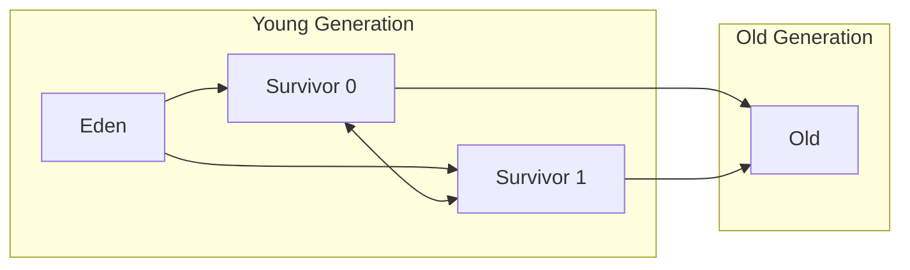

## Automatic Transmission

Most programmers (at least in Romania) start their journey by learning C in school. In languages like C, you have to manage memory manually. You need to allocate memory and free it up when you're done with it. This is somewhat akin to a car with manual transmission, where you need to shift gears yourself. This manual approach leaves a lot of room for error. You can either forget to free up memory or free it up too early, both of which end really badly. 

To take this burden off of the programmers, garbage collection was introduced. Just like with automatic transmission in cars, where the car handles gear shifts automatically, the garbage collector handles memory management automatically. This takes a lot of pressure off of the developers, but, as always, there are trade-offs.

## How GC Works

Whenever you are creating objects, they are created on the heap. The heap is the memory region used for dynamic allocation. 
The garbage collector will keep an object alive as long as it is reachable. (As a side note, "reachability" isn't always binary in Java—there are special types like `WeakReference` and `SoftReference` that the GC treats differently, but we'll focus on standard strong references here.)

Simple version: If your code can still reach an object, the garbage collector considers it alive. If you need to access a static variable that points to an object that points to another object that points to another object ... you can reach all of them and they are still considered alive.

Comprehensive version: The JVM builds graphs of references starting from **GC roots**. To be technically precise, roots are usually the **references** themselves (like pointers in a stack frame or registers), not the objects. The objects they point to are the first living objects in the heap. Any objects that can be reached from a root are considered alive as well. 

There are a few types of GC roots:
- Variables on the stack: Local variables are GC roots for as long as the method they are local to is executing. This is also true for method parameters and everything currently in the stack.
- Class loaders: Class loaders point to classes, which themselves point to things like `static` variables. 
- `JNI` references: Java Native Interface allows Java to call code in other languages, and its references are GC roots for as long as they are alive.
- Monitors (the objects used as intrinsic locks when you use `synchronized`)

### Core Phases & Stop-the-World

Most garbage collectors perform their work in three basic steps:
1. **Mark**: The GC traverses the object graph starting from the roots, marking every object it can reach as alive.
2. **Sweep**: The GC scans the heap memory and reclaims the space occupied by any unmarked (dead) objects.
3. **Compact** (Optional but common): Since sweeping leaves "holes" in memory (fragmentation), the GC will often move the surviving objects together so that free memory is in one large, continuous block.

During some or all of these phases, the garbage collector has to completely pause your application's threads to safely move objects or update references. This is called a **Stop-the-World (STW)** pause, and it's the "latency spike" that developers often try to minimize.

## The Generational Hypothesis

Here's an observation that changed how garbage collectors are designed: **most objects die young**. You create a temporary `StringBuilder` inside a method, use it, and by the time the method returns, nobody cares about it anymore. Meanwhile, some objects, like your database connection pool or your application configuration, stick around for the entire lifetime of the application.

This is called the **weak generational hypothesis**, and it's the idea behind generational garbage collection. Instead of treating every object the same, the garbage collector splits the heap into generations.

### Young Generation

This is where new objects are born. It's relatively small and gets collected **very frequently**. The idea is that since most objects die young, most collections of this space will free up a lot of memory very quickly. These collections are called **minor GCs** (or young GCs).

The young generation itself is split into three parts: **Eden** and two **Survivor spaces** (S0 and S1). New objects land in Eden. (Under the hood, to make this fast, threads get their own private chunks of Eden called **Thread-Local Allocation Buffers**, or TLABs, so they can allocate objects without locking the entire heap). When Eden doesn't have enough room for a new allocation (a situation called an **allocation failure**), a minor GC is triggered. The surviving objects get copied to one of the survivor spaces. Objects that survive enough minor GC cycles get promoted to the old generation.

### Old Generation

Objects that survive long enough in the young generation eventually get promoted here. This region is larger and collected less frequently. When it does get collected, it's called a **major GC**, and it usually takes longer because there's more data to scan. (Note: A major GC cleans just the old generation, whereas a **full GC** cleans the entire heap, both young and old). These are the collections that typically cause noticeable pauses in your application.

The beauty of this setup is that the garbage collector spends most of its time quickly scanning the small young generation, and only occasionally does the expensive full scan of the old generation.

## Not All JVMs Are Created Equal

One thing worth mentioning: **different JVM implementations can use different garbage collectors**. When we talk about garbage collectors in Java, we're usually talking about HotSpot (the JVM that comes with Oracle JDK and OpenJDK), but other JVMs like Eclipse OpenJ9, GraalVM, or Azul Zing have their own garbage collector implementations with different trade-offs.

Even within HotSpot, the default garbage collector has changed over the years. So when someone says "Java's garbage collector does X", they're usually being a bit imprecise.

With that caveat out of the way, let's look at what HotSpot has to offer.

## Types of Garbage Collectors

HotSpot alone ships with several garbage collectors, each designed for different workloads. Here's a quick rundown:

### Serial GC

The simplest one. It does all its work in a **single thread** and **stops the world** (pauses your entire application) while it's collecting. It's like closing a restaurant to clean the kitchen. Not great for production servers, but it has low overhead and works just fine for small applications or when you're running on a machine with a single CPU core.

You can enable it with `-XX:+UseSerialGC`.

### Parallel GC

Same idea as Serial, but it uses **multiple threads** for garbage collection. It still stops the world, but the pause is shorter because the work is done in parallel. This was the default collector for server-class machines in Java 8 and is also called the **throughput collector** because it's optimized for maximizing the amount of work your application gets done.

You can enable it with `-XX:+UseParallelGC`.

### CMS (Concurrent Mark-Sweep)

CMS was designed to minimize pause times. It does **most of its work concurrently** with your application threads, only pausing briefly for certain phases. The trade-off? It uses more CPU and can suffer from **heap fragmentation** since it doesn't compact memory (it just sweeps away dead objects, leaving gaps). 

CMS was deprecated in Java 9 and removed in Java 14. If you're still using it, it might be time to move on.

### G1 (Garbage-First)

G1 is the **default collector since Java 9**. Instead of the traditional contiguous young/old generation layout, G1 splits the heap into many small **regions** and can collect the regions with the most garbage first (hence the name). It aims for a balance between throughput and low pause times, and you can even set a target pause time with `-XX:MaxGCPauseMillis`.

G1 is a solid general-purpose choice and the one you'll encounter most often in modern Java applications.

You can enable it with `-XX:+UseG1GC`.

### ZGC

ZGC is designed for **ultra-low pause times**. We're talking pauses in the **sub-millisecond** range, regardless of how big your heap is. It does almost all of its work concurrently and can handle heaps from a few hundred megabytes to **multi-terabyte** sizes.

ZGC became production-ready in Java 15 and received major updates in recent versions (like becoming generational by default in Java 21). Note that **G1 remains the default garbage collector**, so you still have to explicitly enable ZGC. If your application is latency-sensitive and you're on a recent Java version, ZGC is worth a serious look.

You can enable it with `-XX:+UseZGC`.

### Shenandoah

Shenandoah is similar to ZGC in its goals: **low pause times** with concurrent collection. It was developed by Red Hat and is available in OpenJDK (but not in Oracle's builds). The internals differ significantly (for example, Shenandoah uses Brooks pointers for concurrent compaction while ZGC uses colored pointers and load barriers), but from a user's perspective, both aim to solve the same problem.

You can enable it with `-XX:+UseShenandoahGC`.

## My Thoughts

For 99% of Java applications out there, you will never need to think about which garbage collector to use. The defaults are genuinely good, and the JVM has gotten exceptionally smart about managing memory on its own. Don't be that person that spends days tuning GC flags on applications that process a handful of requests per second. 

That said, knowing how garbage collection works is still valuable. When you eventually run into a GC-related issue (and if you stick around long enough, you will), understanding the difference between a minor GC and a full GC, or knowing that your 50ms latency spike lines up suspiciously with a G1 mixed collection, can save you hours of head-scratching.

Garbage collection is a beautiful example of "no free lunches" in computer science. You trade manual memory management for automatic memory management, but in return you accept that some CPU cycles and some pause time will go towards the garbage collector doing its thing. For most applications, that's an excellent trade-off. For a few, it isn't (and that's why languages like Rust and C++ still very much have their place).

At the end of the day, the best GC tuning is writing code that doesn't generate unnecessary garbage in the first place. But that's a topic for another article.

