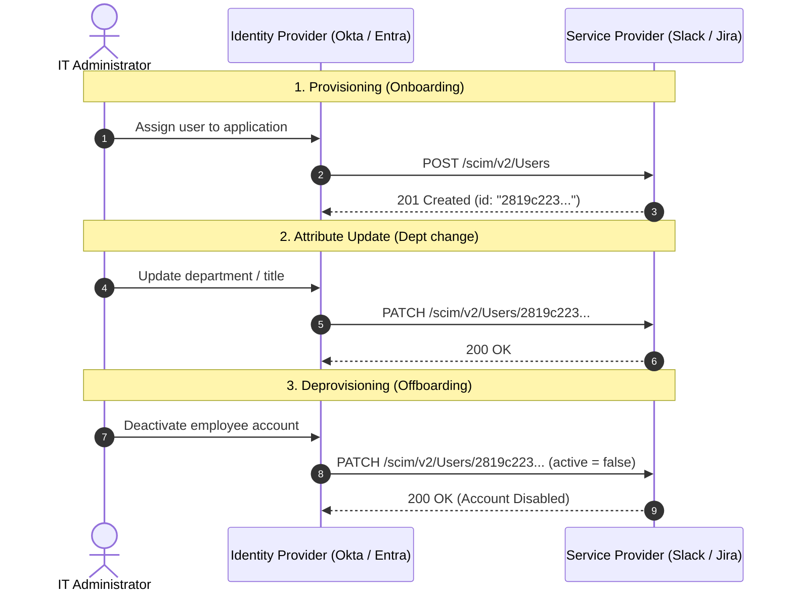

## The Onboarding and Offboarding Nightmare

A lot of things sound very simple and straight forward until you actually go ahead and try to do them. In our current episode of "Have you thought of?", we're going to be exploring the following scenario: You joined a new company. The IT department uses Azure AD or Okta to manage users and groups and adds your user in the company directory. But how does your user end up in all the other tools you use every day, like Jira, Slack, GitHub, and so on? (This example could also have been about you leaving and your user being deprovisioned, but I hope that would have been sadder.)

Most likely, the provisioning process is automated using the **SCIM (System for Cross-domain Identity Management)** protocol. 

## Enter SCIM

**SCIM** stands for **System for Cross-domain Identity Management**. It's an open standard defined in **RFC 7643** (Core Schema) and **RFC 7644** (Protocol) that automates the process of creating, updating, and deleting user accounts across multiple applications.

So SCIM lets your Identity Provider (like Okta, Azure AD, or Google Workspace) **automatically push user changes** to all the apps your organization uses. The protocol is REST-based and uses JSON payloads.

## The Actors

Before we get into the schema and payloads, let's define who's who in a SCIM setup. There are really only two roles, but the terminology can get confusing due to the direction of the relationship.

- **The Identity Provider (IdP)**: This is the system that is the **source of truth** for user identities (Okta, Microsoft Entra ID, Google Workspace). In SCIM terms, the IdP acts as the **SCIM Client**. It's the one making HTTP requests.
- **The Service Provider (SP)**: This is the application that needs to know about your users (Slack, Jira, GitHub, Salesforce). In SCIM terms, the SP acts as the **SCIM Server**. It exposes a REST API and responds to the client's requests.

The direction of the relationship is important: the most common pattern is **push-based**, where the **IdP pushes changes to the SP**. The IdP says "here's a new user, create them" or "this user left, deactivate them," and the SP complies.

**Pull-based** flows are also possible, where the SP periodically sends `GET` requests to the IdP to discover changes (polling). Notice that in this scenario, **the roles get reversed**: the SP becomes the **SCIM Client** (since it initiates the HTTP requests) and the IdP acts as the **SCIM Server** hosting the endpoints. This is useful for initial sync or reconciliation. In practice, push implementations handle timing differently under the hood: some push events immediately via webhooks, while others (like Entra ID) run periodic sync cycles to discover internal changes before pushing them.

That said, the push model is what most people mean when they talk about SCIM provisioning, and it's the flow we'll focus on in this article.

## The Core Resources

SCIM is built around two main resource types: **Users** and **Groups**. Every SCIM-compliant service must support at least Users, and most support Groups as well.

### Users

A SCIM User is a representation of a person with a standardized set of attributes. Here's what a typical User resource looks like:

```json
{
  "schemas": ["urn:ietf:params:scim:schemas:core:2.0:User"],
  "id": "2819c223-7f76-453a-919d-413861904646",
  "externalId": "alex.gherghe",
  "userName": "alex.gherghe@company.com",
  "name": {
    "givenName": "Alex",
    "familyName": "Gherghe"
  },
  "emails": [
    {
      "value": "alex.gherghe@company.com",
      "type": "work",
      "primary": true
    }
  ],
  "displayName": "Alex Gherghe",
  "active": true,
  "groups": [
    {
      "value": "e9e30dba-f08f-4109-8486-d5c6a331660a",
      "display": "Engineering"
    }
  ],
  "meta": {
    "resourceType": "User",
    "created": "2026-08-23T10:00:00Z",
    "lastModified": "2026-08-23T10:00:00Z",
    "location": "https://app.example.com/scim/v2/Users/2819c223-7f76-453a-919d-413861904646"
  }
}
```

A few things to note here:

- The **`schemas`** field declares which schema this resource conforms to. This is how SCIM handles extensibility: you can add custom schemas (called **schema extensions**) for vendor-specific attributes without breaking the standard. In fact, RFC 7643 defines a standardized **Enterprise User Schema Extension** (`urn:ietf:params:scim:schemas:extension:enterprise:2.0:User`) for common corporate attributes like `employeeNumber`, `costCenter`, `organization`, `division`, `department`, and `manager`.
- **`id`** is assigned by the service provider (the app) and is immutable. **`externalId`** is assigned by the SCIM client (the IdP) and is how the IdP keeps track of which user maps to which record on the other side.
- **`active`** is the boolean that controls whether the account is enabled. This is the field that gets flipped to `false` when someone is offboarded, more on that later.
- The **`meta`** object contains read-only metadata: when the resource was created, when it was last modified, and its canonical URL.

### Groups

A SCIM Group is a collection of users. Groups have a **displayName** and a list of **members**, where each member is a reference to a User resource:

```json
{
  "schemas": ["urn:ietf:params:scim:schemas:core:2.0:Group"],
  "id": "e9e30dba-f08f-4109-8486-d5c6a331660a",
  "displayName": "Engineering",
  "members": [
    {
      "value": "2819c223-7f76-453a-919d-413861904646",
      "display": "Alex Gherghe"
    },
    {
      "value": "902c246b-6245-4190-8e05-00816be7344a",
      "display": "Jane Doe"
    }
  ]
}
```

## The Endpoints

SCIM exposes a REST API with a small number of well-defined endpoints:

| Endpoint | Methods | Purpose |
|---|---|---|
| `/Users` | GET, POST | List/search users, create a new user |
| `/Users/{id}` | GET, PUT, PATCH, DELETE | Read, replace, update, or delete a specific user |
| `/Groups` | GET, POST | List/search groups, create a new group |
| `/Groups/{id}` | GET, PUT, PATCH, DELETE | Read, replace, update, or delete a specific group |
| `/Schemas` | GET | Discover supported schemas |
| `/ResourceTypes` | GET | Discover supported resource types |
| `/ServiceProviderConfig` | GET | Discover server capabilities |

The last three endpoints are **discovery endpoints**. They let the SCIM client figure out what the server supports without any prior out-of-band configuration. A client can query `/Schemas` to inspect supported attribute definitions and schema extensions, `/ResourceTypes` to discover available endpoints and their metadata, and `/ServiceProviderConfig` to check operational capabilities like PATCH support, filtering options, and bulk limits.

### Standard Error Responses

When something goes wrong, SCIM defines a standardized error format in RFC 7644 (`urn:ietf:params:scim:api:messages:2.0:Error`). Instead of returning arbitrary error JSON, the server responds with a structured payload:

```json
{
  "schemas": ["urn:ietf:params:scim:api:messages:2.0:Error"],
  "status": "400",
  "scimType": "uniqueness",
  "detail": "A user with userName 'alex.gherghe@company.com' already exists."
}
```

The spec defines standard `scimType` error keywords that pair specifically with **HTTP 400 (Bad Request)** responses:
- **`uniqueness`** (HTTP 400): One or more attribute values (like `userName` or `externalId`) are already in use or reserved. Note that servers may also return HTTP 409 (Conflict) for general duplicate conflicts.
- **`invalidFilter`** / **`invalidSyntax`** (HTTP 400): The filter query or payload syntax is malformed.
- **`mutability`** (HTTP 400): The client tried to modify a read-only or immutable attribute (like `id`).
- **`sensitive`** (HTTP 400): The request cannot be completed because sensitive personal information would be transmitted over a request URI (e.g. in GET filter parameters).
- **`tooMany`** (HTTP 400): The specified filter yields many more results than the server is willing to calculate or process.

## How It Works in Practice

The typical SCIM setup involves two parties:

- **The SCIM Client**: usually your IdP (e.g. Okta). This is the system that knows about your users and initiates changes.
- **The SCIM Server**: the application being provisioned (e.g. Slack). This is the system that receives the changes and acts on them.

Here is what that lifecycle looks like over HTTP:



### The User Lifecycle

Let's walk through the full lifecycle of a user, from onboarding to offboarding.

**Creating a user.** An admin assigns a user to an application in the IdP. The IdP sends a `POST` to `/Users`:

```
POST /scim/v2/Users
Content-Type: application/scim+json
Authorization: Bearer <token>
```
```json
{
  "schemas": ["urn:ietf:params:scim:schemas:core:2.0:User"],
  "userName": "alex.gherghe@company.com",
  "name": {
    "givenName": "Alex",
    "familyName": "Gherghe"
  },
  "emails": [
    {
      "value": "alex.gherghe@company.com",
      "type": "work",
      "primary": true
    }
  ],
  "active": true
}
```

The server creates the account and responds with `201 Created`, including the server-assigned `id` in the response body.

**Updating a user.** The user changes departments, gets a new title, or updates their email. The IdP sends a `PATCH` to `/Users/{id}`:

```
PATCH /scim/v2/Users/2819c223-7f76-453a-919d-413861904646
Content-Type: application/scim+json
Authorization: Bearer <token>
```
```json
{
  "schemas": ["urn:ietf:params:scim:api:messages:2.0:PatchOp"],
  "Operations": [
    {
      "op": "replace",
      "path": "name.familyName",
      "value": "Gherghe-Smith"
    }
  ]
}
```

The PATCH operation is modeled after a simplified version of JSON Patch. You can **add**, **replace**, or **remove** individual attributes without sending the entire resource. This is important because some User objects can get large, and you don't want to send a full `PUT` replacement every time someone's phone number changes.

That said, `PUT` is also supported and does a full replacement of the resource. Some IdPs prefer `PUT` over `PATCH` because it's simpler to implement (you just send the whole object), even though it's less efficient.

SCIM also supports **versioning and optimistic concurrency control** via HTTP `ETag` and `If-Match` headers. If multiple clients or sync jobs attempt to modify a resource simultaneously, the server can reject stale writes with **HTTP 412 (Precondition Failed)**, preventing race conditions from quietly overwriting user data.

**Deactivating a user.** When someone leaves the company, the IdP typically sends a `PATCH` request setting `active` to `false`:

```
PATCH /scim/v2/Users/2819c223-7f76-453a-919d-413861904646
```
```json
{
  "schemas": ["urn:ietf:params:scim:api:messages:2.0:PatchOp"],
  "Operations": [
    {
      "op": "replace",
      "path": "active",
      "value": false
    }
  ]
}
```

Why `PATCH` instead of `DELETE`? Because most organizations want a **soft delete**. The user account still exists in the system (for audit trails, data retention, etc.), but it's disabled. A full `DELETE` would remove the resource entirely, which is usually not what you want. The `active` flag is the SCIM way of saying "this person shouldn't be able to log in anymore, but keep their data around."

## Filtering, Pagination, and Bulk Operations

SCIM wouldn't be very useful if the only way to find a user was by their `id`. The protocol supports several features that make it practical at scale.

### Filtering

The `GET /Users` endpoint supports a **`filter`** query parameter that lets you search for users by attribute. The syntax looks like this:

```
GET /scim/v2/Users?filter=userName eq "alex.gherghe@company.com"
```

The spec defines a set of comparison operators: `eq` (equals), `ne` (not equals), `co` (contains), `sw` (starts with), `ew` (ends with), `gt`, `ge`, `lt`, `le`, and logical operators `and`, `or`, `not`. Not every server supports all of them: that's what the `/ServiceProviderConfig` endpoint is for.

Filtering is important during the initial provisioning sync. When an IdP connects to an app for the first time, it needs to figure out which users already exist so it doesn't create duplicates. It does this by filtering on a unique attribute (usually `userName` or `externalId`) before deciding whether to `POST` a new user or `PATCH` an existing one.

You can combine the filter operators and use parentheses for grouping. This can mean that (in theory), filters can get really complicated. Good luck parsing and implementing them, you will need it. 

### Pagination

When you have thousands of users, you don't want to return them all in a single response. SCIM supports pagination through the **`startIndex`** and **`count`** parameters:

```
GET /scim/v2/Users?startIndex=1&count=100
```

The response includes `totalResults`, `startIndex`, and `itemsPerPage` so the client knows how many pages there are. Keep in mind that SCIM pagination is **1-indexed** (not 0-indexed), which trips up a lot of developers on their first implementation.


### Bulk Operations

The spec also defines a `/Bulk` endpoint for bundling multiple operations into a single HTTP request. This is useful during initial provisioning when you need to create hundreds or thousands of users at once:

```json
{
  "schemas": ["urn:ietf:params:scim:api:messages:2.0:BulkRequest"],
  "Operations": [
    {
      "method": "POST",
      "path": "/Users",
      "bulkId": "user-1",
      "data": {
        "schemas": ["urn:ietf:params:scim:schemas:core:2.0:User"],
        "userName": "user1@company.com"
      }
    },
    {
      "method": "POST",
      "path": "/Users",
      "bulkId": "user-2",
      "data": {
        "schemas": ["urn:ietf:params:scim:schemas:core:2.0:User"],
        "userName": "user2@company.com"
      }
    }
  ]
}
```

In practice, bulk support is hit-or-miss. The spec marks it as **optional**, and most major IdPs (including Okta and Entra ID) **don't use the `/Bulk` endpoint** in their standard provisioning flows. They prefer to send individual requests, sometimes with their own internal batching and retry logic. Servers that do support bulk operations often impose strict limits (say, 500 or 1,000 operations per request). Many teams find that incremental sync (filtering by `meta.lastModified`) is more reliable than bulk operations for keeping directories in sync.

## Securing the SCIM Endpoint

SCIM endpoints need to be secured because they literally control who has access to your application. The spec recommends using some sort of authentication, like **OAuth 2.0 Bearer Tokens**, and in practice, this is how most implementations work.

The typical setup goes like this: the service provider generates a **long-lived API token** (or you set up a proper OAuth 2.0 client credentials flow), and the IdP includes this token in the `Authorization` header of every SCIM request. The service provider validates the token and processes the request.

The spec also **strongly recommends** that SCIM endpoints only be accessible over **TLS (HTTPS)**. This should go without saying in 2026, but it's worth mentioning because the payloads contain PII (names, emails, phone numbers, group memberships). Sending that in plain text would be a very bad time.

## The Spec's Rough Edges

SCIM is a good protocol. It provided some nice standardization for a problem that previously was solved in many different ways, but it's not without its structural limitations, and some of them get painful at scale.

### The Large Group Problem

This is probably the biggest pain point in SCIM. A Group resource includes its full list of members as a **multi-valued attribute** inside the JSON object. For a small team, that's fine. For a group like "All Employees" at a 50,000-person company, you're looking at a JSON payload that can easily exceed **100 MB**.

The problem isn't just about writes. Yes, you can use `PATCH` to add or remove individual members instead of `PUT`-ing the entire group, and that helps for updates. But every time you **read** the group with a `GET /Groups/{id}`, you get the full membership list back in the response. That's the same massive payload, just for checking what's there. The issue is baked into the schema itself: members are embedded inline, so the resource just grows without bound.

You can work around it on the read side by using the `excludedAttributes=members` query parameter to fetch the group without its member list, and then paginating through the members separately, but you're essentially at the mercy of your SCIM client. 

And yes, this hits real IdPs in production. **Okta** will sometimes try to send all members in a single `PUT` or `PATCH` request when first pushing a group. If the target app can't handle the payload, it just fails.

### No Password Management

SCIM provisions user accounts, but it **does not handle passwords**. There's no standard way to sync or set passwords through SCIM. The protocol is purely about identity lifecycle: creating the account, updating attributes, deactivating it. How the user actually authenticates is explicitly out of scope.

This is by design. The assumption is that if you're using SCIM, you're also using SSO (via SAML or OIDC), so users never need a password for the app in the first place: they authenticate through the IdP. But not every app supports SSO, and some apps require a local password as a fallback. In those cases, SCIM can create the account but can't set the password. The target app usually handles this by sending an activation or password-reset email to the user's primary email address (`emails[primary].value`) once the account is provisioned via SCIM. It works, but it's one more step that isn't completely hands-off.

### The Roles and Permissions Gap

SCIM can tell an app that a user exists and which groups they belong to. What it **can't** do is tell the app what that user is allowed to do inside the app.

The SCIM schema does include **`roles`** and **`entitlements`** fields, but they're basically free-text: the spec doesn't define what the values mean. It's up to each app to interpret them. So you can push `role: "admin"` to an app via SCIM, but whether that actually makes the user an admin depends entirely on how the app reads that field. Most apps ignore these fields entirely and rely on group memberships to infer permissions instead.

The result is that SCIM handles **identity** (who you are) and **group membership** (what teams you're on), but **authorization** (what you're allowed to do) is always a separate system. If you need fine-grained access control (like "this user can view reports but not edit them"), that logic lives in the app itself or in a dedicated authorization service.

### Offset-Based Pagination at Scale

The core SCIM 2.0 specification relies on **offset-based pagination** using `startIndex` and `count`. While that works fine for small user directories, it falls apart in enterprise environments with tens or hundreds of thousands of users.

First, offset pagination has the classic **database scanning problem**. When an IdP requests `startIndex=80001&count=100`, the server's database typically has to scan and discard the first 80,000 records before returning the next 100. As the sync crawls deeper into a large directory, queries get slower, database load spikes, and requests start timing out.

Second, offset pagination suffers from **data drift during sync**. If users are added or removed while the IdP is paginating through the directory, the pagination window shifts. A newly inserted user can cause subsequent users to shift by one position, resulting in skipped records or duplicate processing across page boundaries. 

The IETF addressed this by publishing **RFC 9865**, which introduces **cursor-based pagination** to SCIM via `cursor` and `nextCursor` parameters. Cursors fix both the performance degradation and the shifting window problem. But because it's an extension, adoption across existing IdPs and SaaS providers is still catching up. In practice, most SCIM integrations out there are still grinding through directories with `startIndex`.

## SCIM in the Wild: How the Big IdPs Actually Do It

The SCIM spec is reasonably well-written and reasonably clear. The implementations... less so. The spec has a lot of "SHOULD" and "MAY" language, which means every IdP has interpreted things a little differently. Here is what happens when you look at how the major players implement it in practice.

### Okta

Okta is probably the most widely used SCIM client out there, and they've been doing it long enough to have some strong opinions.

**PATCH vs. PUT depends on integration type.** If you use an app from Okta's **OIN Catalog** (their pre-built integration library), the connector typically uses `PATCH` for partial updates. But if you set up a custom SCIM integration through the **App Integration Wizard**, it defaults to `PUT` (full resource replacement). You often can't change this after the fact, so it's worth knowing upfront.

**Filtering is mandatory.** When Okta provisions a user, it first sends a `GET /Users?filter=userName eq "..."` request to check if the user already exists. If your SCIM server doesn't support this exact filtering pattern, Okta will create duplicate users. This catches a lot of people off guard when building custom SCIM servers.

**Retry logic has a quirk.** Okta retries failed requests with exponential backoff (up to **10 attempts**), but it only recognizes **integer values (in seconds)** in the `Retry-After` header. If your server sends a float, an HTTP-date, or omits the header entirely, Okta falls back to a **default five-minute wait** between retries, which may be far longer than your server intended.

**Group push is confusing.** Okta separates "assigning a user to an app" from "pushing a group to an app." Users must be explicitly assigned to the application before their group membership can be pushed via SCIM. The distinction between "User Assignment" and "Group Push" is a frequent source of "why are my group members missing?" tickets.

### Microsoft Entra ID (Azure AD)

Microsoft's identity platform takes a different approach in a few key areas.

**It's not real-time.** This is the big one. Entra ID doesn't push changes immediately. Sync cycles run every **20 to 40 minutes**. So if someone is deactivated in your directory, downstream apps won't know about it for up to 40 minutes. For most organizations this is fine, but if you need instant deprovisioning for compliance reasons, this delay is something to account for.

**No nested group support.** Entra ID **cannot** sync nested groups via SCIM. If your organization uses a group structure like "Engineering" containing "Backend" and "Frontend" subgroups, those nested memberships won't propagate. You need to flatten your group structure before provisioning, which is annoying but workable.

**Deleted attributes can get stuck.** There's a known issue where if an attribute is cleared in Entra ID (e.g., removing a phone number), the change may not trigger a corresponding `PATCH` to remove it in the target app. This can lead to stale data sitting in your downstream systems without anyone noticing.

**Aggressive rate of requests.** Entra ID can be a pretty aggressive SCIM client. During initial provisioning, it sends requests fast enough to trigger rate limits on many SPs. If the SP pushes back with too many `429` responses, Entra ID's provisioning service can go into **quarantine mode**: it basically gives up and requires manual intervention to restart. Not ideal.

**Requires a premium license.** Automated SCIM provisioning is only available on **Entra ID Premium P1 or P2** plans. If your organization is on the free tier, you're back to manual provisioning.

### Google Workspace

Google Workspace is a bit of an odd one because its SCIM capabilities are **asymmetric**: it works well as a destination but is limited as a source.

**As a destination (inbound), it works well.** If you're using Okta or Entra ID as your primary IdP and want to provision users into Google Workspace, Google's **inbound SCIM API** works as expected. You generate a token in the Admin console, configure it in your IdP, and user lifecycle events flow through.

**As a source (outbound), it's limited.** If you want Google Workspace to push users to downstream apps (i.e., act as the SCIM client), you're restricted to a **small catalog of supported apps**. There's no generic "connect to any SCIM endpoint" option. If the app you need isn't in Google's catalog, you're out of luck: you'll need middleware or a third-party tool.

**No custom attribute mapping.** Unlike Okta and Entra ID, Google doesn't let you customize which attributes get sent or how they're mapped. It's a "what you see is what you get" situation. If the default mapping doesn't match what the SP expects, there's no way to fix it without building something custom in between.

The general advice from practitioners is: if your organization uses Google Workspace, use it as a **destination** synced from a dedicated IdP (like Okta or Entra ID), rather than trying to use it as the primary source for provisioning.

### The Common Gotchas (Across All IdPs)

Regardless of which IdP you use, there are a few recurring issues:

- **`userName` format mismatch**: The spec says `userName` must be unique but doesn't prescribe a format. Some apps expect an email, some expect a plain username. If the IdP sends `alex.gherghe@company.com` and the app expects `alex.gherghe`, things break in confusing ways.
- **Soft delete inconsistencies**: Most IdPs deactivate users by setting `active` to `false`, but some apps don't properly honor this flag and still allow login through other means (like a direct password).
- **Token expiry**: SCIM bearer tokens often have fixed lifetimes set by the destination application (a 6-month expiration is common for services like Snowflake). When they expire, provisioning silently fails until someone notices and rotates the token.
- **Rate limiting**: Every SP handles rate limits differently, and the SCIM spec doesn't define a standard approach. Initial syncs of thousands of users can take hours due to backoff and retry.

## Some Takeaways

SCIM is one of those things that's invisible when it works well, but painfully noticeable when it's missing. If you've ever had to manually provision users across a dozen apps, you know the feeling.

- **It's just REST**: SCIM is a straightforward REST API with JSON payloads. No XML, no convoluted signature schemes. If you've ever built a CRUD API, you already understand 90% of SCIM.
- **Push, not pull**: The IdP most commonly pushes changes to apps in near real-time. This is a big deal for security: deprovisioning happens systematically, without having to wait for someone to remember to manually revoke access across every app (even if some IdPs batch updates every 20 to 40 minutes).
- **The spec is good, the implementations vary**: The RFC is well-written and practical. But every service provider implements it slightly differently, and the "SHOULD" vs "MUST" distinctions in the spec give vendors enough room to keep IdP engineers busy writing per-app connectors.
- **It pairs with SAML (or OIDC)**: SCIM doesn't replace your authentication protocol. It complements it. SAML or OpenID Connect handles the login; SCIM handles the lifecycle. JIT provisioning can cover the basics, but it falls apart when you need deprovisioning or proactive attribute updates.
- **Adoption is widespread**: Most major SaaS apps support SCIM today. Slack, GitHub, Atlassian, Zoom, Salesforce: they all have SCIM endpoints. If you're building a B2B SaaS product, supporting SCIM is basically table stakes at this point.

If you want to dig deeper, the official specs are [RFC 7643 (Core Schema)](https://datatracker.ietf.org/doc/html/rfc7643) and [RFC 7644 (Protocol)](https://datatracker.ietf.org/doc/html/rfc7644). 
