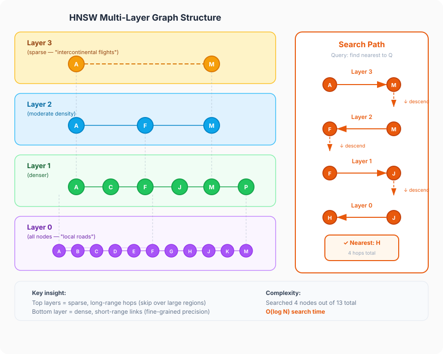

## The "Find Me Something Like This" Problem

Queries in traditional databases are often **exact matches**. You look up a user by ID, a transaction by order number, or a product by SKU. The database engine uses indexes (like **B-trees**) to quickly locate the exact record that matches your query. Your search can even be somewhat fuzzy, for instance `SELECT * FROM users WHERE username LIKE '%alex%'`, but this is still based on **string matching**. 

**Full-text search** offers an improvement, but it only works for text and it's based on **keyword matching**, not **semantic understanding**. 

The problem that arose with the rise of AI is the need to rapidly search for things that are **related** to certain queries or concepts. For instance, you may need to look up all articles related to customers canceling their contracts to feed into your AI agent. This is extremely common in **RAG (Retrieval Augmented Generation)** systems. Traditional databases fall short of being able to help us here, so we need to use something else. That something else is a **vector database**. They are useful for **semantic search**, **recommendation engines**, and a growing list of other applications. But how do they actually work? And more importantly, how do they search through millions of vectors without melting your servers?

## Vectors All the Way Down

Vector databases can take in a lot of **data modalities** (text, images, audio, video) and store them alongside their vector representation. A vector is in essence just an **array of floating-point numbers**, typically between **384 and 1536 dimensions** long. These vectors are generated by machine learning models (called **embedding models**).

If you've read my articles about [what a token is](https://alexgherghe.com/articles/what-is-a-token.html) or [how multimodal LLMs work](https://alexgherghe.com/articles/how-multimodal-llms-work.html), you've already seen embeddings in action. What you need to remember is that these vectors **encode meaning** and each of their dimensions represents some aspect of that meaning. Data points that are **semantically similar** end up close together in this high-dimensional space. The words "cat" and "feline" will have vectors that are mathematically nearby, even though the strings themselves are nothing alike.

A vector database, then, is a database optimized for storing these vectors and answering one question very fast: **"given this query vector, which stored vectors are closest to it?"**

## How Do You Measure "Close"?

Before we can find the closest vectors, we need to define what "close" means. There are three common distance metrics:

- **Cosine Similarity**: Measures the **angle** between two vectors. It doesn't care about how "long" the vectors are, only the **direction** they point in. This is the go-to for text and NLP tasks, where what matters is the **semantic direction**, not the magnitude.
- **Euclidean Distance**: The **straight-line distance** between two points. Think of it as pulling out a ruler in vector space. Good for cases where the **absolute difference in values** matters.
- **Dot Product**: A combination of **angle and magnitude**. Useful when both the direction and the scale carry meaning (for example, user activity levels in a recommendation system).

There is an interesting engineering trick here: **vector normalization**. If you normalize your vectors so their length (magnitude) is **1**, cosine similarity and dot product become **mathematically identical**. In fact, Euclidean distance on normalized vectors also produces the **exact same nearest-neighbor rankings** as cosine similarity. Many vector databases take advantage of this by normalizing vectors on insert so they can use **super-fast dot product** operations.

Outside of normalized vectors, the golden rule applies: **always use the same metric that your embedding model was trained with**. If a model was trained to optimize for cosine similarity with unnormalized vectors, using Euclidean distance in your database will give you **garbage results**. It's like measuring temperature in Fahrenheit and then comparing it to a Celsius threshold.

## The Naive Approach

The simplest way to find the nearest vectors is to just compute the distance from your query to **every single vector** in the database and pick the closest ones. This is **O(N * D)**, where **N** is the number of vectors and **D** is the number of dimensions. That doesn't sound terrible on paper, but when you have **10 million vectors** with **1536 dimensions each**, calculating billions of floating-point operations per query will quickly bring your servers to their knees.

But that's not even the worst part. High-dimensional spaces have a nasty property called the **curse of dimensionality**. As you add more dimensions, something counterintuitive happens: the **relative difference between the nearest neighbor and the farthest neighbor shrinks toward zero**. In 768 or 1536 dimensions, all points start looking almost equally far away. This means that traditional spatial indexing structures (like **KD-trees** or **Ball trees**) that work great in 2D or 3D become **essentially useless**. Because bounding boxes overlap almost everywhere in high dimensions, they can't prune the search space and inevitably degrade back to a **full linear scan**.

The good news here is that, unlike a relational database, we don't need to find the exact nearest neighbor. An **Approximate Nearest Neighbor (ANN) search** would suffice. In practice, ANN algorithms typically achieve **95-99% recall** (meaning they find the true nearest neighbor 95-99% of the time) while being **orders of magnitude faster** than brute force.

## Enter HNSW

**HNSW** stands for **Hierarchical Navigable Small World**. It was introduced by Yury Malkov and Dmitry Yashunin in **2016** and has since become the **gold standard** for ANN search. Almost every major vector database uses it (Pinecone, Qdrant, Weaviate, Milvus, pgvector, you name it).

The name is quite a mouthful, but underneath the hood, HNSW is the marriage of two clever computer science concepts: **Navigable Small World (NSW) graphs** and **Skip Lists**.

### Concept 1: Navigable Small World (NSW)

You've probably heard of the **"six degrees of separation"** idea, the concept that anyone in the world is connected to anyone else by at most six social hops. That's a **small world network**.

In graph theory, a small world graph combines **high local clustering** (most of your friends know each other) with a few **random long-range links** (a friend living on another continent).

A **Navigable Small World** takes that graph structure and makes it searchable using a simple **greedy routing algorithm**:
1. Start at an **entry node**.
2. Check all its connected neighbors and jump to whichever neighbor is **closest to your query vector**.
3. Keep hopping until **none of the current node's neighbors get you any closer** to the query.

### Concept 2: Skip Lists

A standard linked list is slow to search (**O(N)**) because you have to walk through items one by one. A skip list fixes this by building multiple layers of linked lists on top of each other:
- The bottom layer contains **every single element**.
- Each layer above it acts as an **express lane**, skipping over elements with exponentially fewer nodes.

When looking for a value, you zoom along the top express lane. When you overshoot your target, you drop down a layer to a slower lane and keep going. This brings a linear linked list search all the way down to **O(log N)**.

### Putting Them Together: HNSW

HNSW takes the multi-layered express-lane concept of a **Skip List** and applies it to multi-dimensional **NSW graphs**.

If that still sounds abstract, the intuition becomes super clear when you think about it as an **airport network**.

Imagine you need to get from Bucharest to a small town in rural Japan. You wouldn't drive there. You'd fly from Bucharest to a major hub (say, Frankfurt), then take a long-haul flight to Tokyo, then a domestic flight to a regional airport, and finally drive to the town. Each step narrows your search: **continental → country → region → local**.

HNSW works the same way. It organizes vectors into **multiple layers**:

- **The top layers** are **sparse**. Only a few nodes live here, but they are connected by **long-range links**. They let you jump across vast distances in the vector space very quickly.
- **The bottom layer (Layer 0)** contains **every single vector** in the database, connected by **short-range links**.

The search process is a top-down, greedy traversal:

1. **Start at the top.** You enter the graph at the highest layer, at a **pre-defined entry point**.
2. **Greedily navigate.** At the current layer, you hop from node to node, always moving toward whichever neighbor is closest to your query vector.
3. **Hit a dead end? Go down.** When you reach a point where no neighbor is closer than where you already are (a **local minimum**), you drop down to the next layer.
4. **Repeat and refine.** At the lower, denser layer, you start from where you left off and navigate again. The neighborhood is much more fine-grained now, so you get closer and closer to the **actual nearest neighbor**.
5. **Arrive at the bottom.** By the time you reach **Layer 0**, you've already narrowed down the search to a small local region. A quick scan of the neighborhood gives you your answer.

This layered approach is what gives HNSW its **O(log N)** search complexity.

## Building the Graph

So the search is fast. But how does the graph get built in the first place? This is where things get interesting.

When a new vector is inserted, two things happen:

### Step 1: Pick a Layer

The new node is assigned a **random maximum layer** based on an **exponentially decaying probability**. Most nodes will only exist in the bottom layer (**Layer 0**). A smaller fraction will also exist in **Layer 1**. An even smaller fraction will reach **Layer 2**. And so on. This is directly inspired by the **skip list** logic we looked at earlier.

The practical effect is that the top layers are **naturally sparse**, while the bottom layer is **dense**.

### Step 2: Connect to Neighbors

Starting from the top of the existing graph, the algorithm **greedily navigates down** to find the best entry point. Once it reaches the layers where the new node belongs, it connects the new node to its **closest neighbors** (up to a configurable limit, commonly denoted as **M**).

There's also a **pruning heuristic** at play. When a node would end up with too many connections (which would slow down traversal), the algorithm **prunes redundant neighbors**. If node C is already reachable through a closer node B, the direct link to C might be dropped.

## The Tradeoffs

HNSW is the gold standard, but it's not without its downsides.

**It's memory-hungry.** The entire graph structure lives in **RAM**. For a dataset of **100 million 1024-dimensional vectors** at full precision (**float32**), you're looking at roughly **400GB** just for the raw vectors, plus the graph overhead on top. This is the single biggest limitation of pure HNSW.

**Modern HNSW with Quantization:** To solve this memory crunch, modern vector databases (like Qdrant, Milvus, and Weaviate) frequently combine HNSW with **Scalar Quantization (SQ)** or **Product Quantization (PQ)**. Instead of storing **32-bit floats** in RAM, vectors are compressed down to **8-bit integers** or compact codes for fast in-memory graph routing. Once the top candidate vectors are identified, the database can optionally fetch the uncompressed vectors from disk to rescore them. This gives you the blazing speed and high recall of HNSW with a fraction of the RAM footprint.

**Updates can be tricky.** HNSW supports **incremental insertion** (you can add new vectors without rebuilding), which is great. But **deletions and massive batch updates** can degrade graph quality over time. Some implementations handle this better than others.

**It's not the only game in town.** For scenarios where memory is tight and you want a different approach, **IVF (Inverted File Index)** is a popular alternative. IVF partitions the vector space into **clusters using k-means**, then only searches the nearest clusters at query time. When combined with **Product Quantization (PQ)** (which compresses the vectors themselves), IVF-PQ can be **dramatically more memory-efficient** than uncompressed HNSW, at the cost of some recall. It also requires a **training step** to learn the cluster centroids, which HNSW doesn't.

There's also **LSH (Locality-Sensitive Hashing)**, which hashes similar vectors into the same buckets. It was popular in the early days of ANN search, but in practice, its **recall in high-dimensional spaces tends to be lower** than both HNSW and IVF. You'll rarely see it used in modern vector databases.

| | HNSW (Uncompressed) | HNSW + Quantization (PQ/SQ) | IVF-PQ | LSH |
|---|---|---|---|---|
| **Recall** | Very high | High | Moderate to high | Lower in high dimensions |
| **Speed** | Excellent | Very fast | Good (tunable) | Very fast |
| **Memory** | High (in-memory) | Low to moderate | Low to moderate | Low to moderate |
| **Best for** | Real-time apps, maximum recall | Production scale with balanced RAM | Billion-scale, memory-constrained | Mostly historical |

## Some Takeaways

- **Vector databases** solve the "find me something similar" problem by storing data as high-dimensional vectors and performing similarity search using distance metrics like **cosine similarity**.
- **Brute-force search** works but doesn't scale. The **curse of dimensionality** makes traditional indexing useless in high-dimensional spaces, pushing the industry toward **Approximate Nearest Neighbor** algorithms.
- **HNSW** organizes vectors into a multi-layered graph inspired by skip lists. Top layers provide **long-range navigation**; the bottom layer provides **fine-grained precision**. Search is **O(log N)**.
- **Memory is HNSW's Achilles' heel.** The entire graph lives in **RAM**. Modern systems solve this by pairing HNSW with quantization (or using alternatives like **IVF-PQ**), trading a tiny amount of recall for massive RAM savings.

If you want to go deeper, the [original HNSW paper](https://arxiv.org/abs/1603.09320) by Malkov and Yashunin is the way to go.
 
